# chap 11 컬렉션 프레임웍

### 컬렉션 프레임워크

- 컬렉션 프레임워크란, '데이터 군을 저장하는 클래스들을 표준화한 설계'를 뜻한다.
    - 컬렉션은 다수의 데이터, 즉 데이터 그룹을 의미한다.
    - 프레임 워크는 표준화된 프로그래링 방식을 의미한다.
- cf) 자바 api 문서에서는 컬렉션 프레임워크를 '데이터 그룹을 다루고 표현하기 위한 단일화된 구조'라고 정의하고 있다.
- jdk 1.2부터 등장하면서 다양한 종류의 컬렉션 클래스가 추가되고 모든 컬렉션 클래스를 표준화된 방식으로 다룰 수 있도록 체계화되었다.
- 컬렉션 프레임워크는 컬렉션, 다수의 데이터,을 다루는데 필요한 다양하고 풍부한 클래스들을 제공해서 편리하고
- 또한 인터페이스와 다형성을 이용한 객체지향적 설계를 통해 표준화되어 있기 때문에 사용법을 익히기에도 편리하고 재사용성이 높은 코드를 작성할 수 있다는 장점


### 컬렉션 프레임워크의 핵심 인터페이스

- 컬렉션 프레임워크는 컬렉션데이터 그룹을 크게 3가지 타입이 존재한다고 인식하고 각 컬렉션을 다루는데 필요한 기능을 가진 3개의 인터페이스를 정의
- 그리고 인터페이스 List와 Set의 공통된 부분을 다시 뽑아서 새로운 인터페이스인 Collection을 추가로 정의

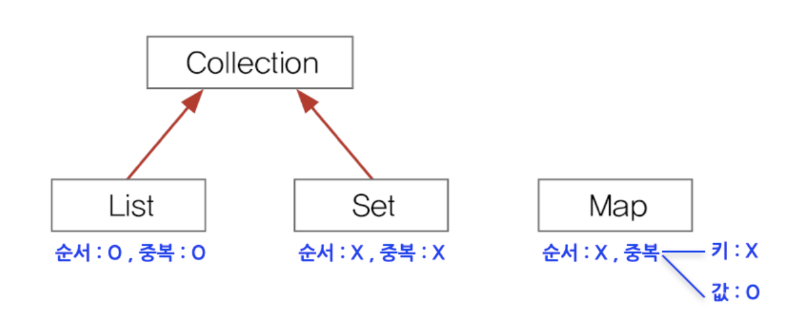

- List와 Set을 구현한 컬렉션 클래스들은 서로 많은 공통부분이 있어서, 공통된 부분을 다시 뽑아 Collection 인터페이스를 정의할 수 있었지만 Map 인터페이스는 이들과는 전혀 다른 형태로 컬렉션을 다루기 때문에 상속계층도에 포함되지 못했다.
- cf) jdk 1.5부터 Iterable 인터페이스가 추가되고 이를 Collection 인터페이스가 상속받도록 변경되었으나 이것은 단지 인터페이스들의 공통적인 메서드인 iterator()를 뽑아서 중복을 제거하기 위한 것에 불과하므로 상속계층도에서 별 의미가 없다.

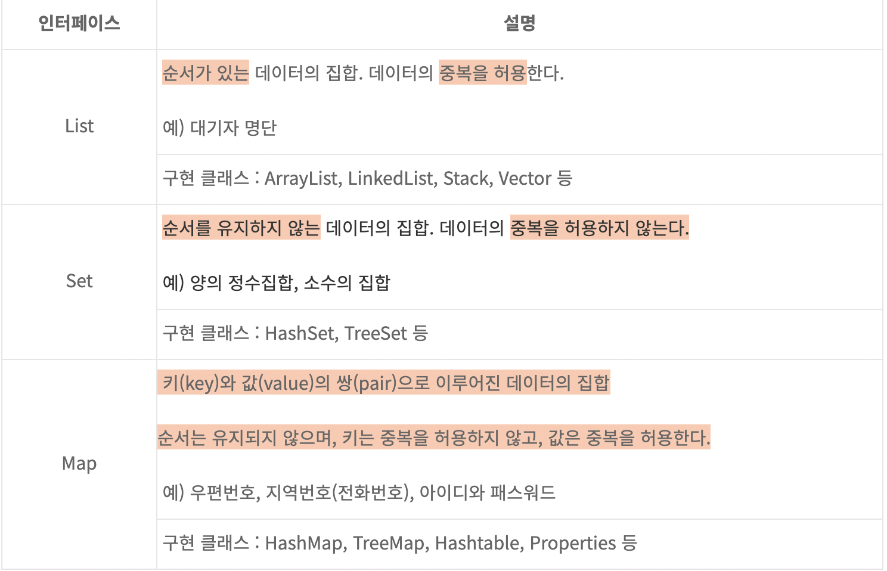

- 컬렉션 프레임워크의 모든 컬렉션 클래스들은 List, Set, Map 중의 하나를 구현하고 있으며, 구현한 인터페이스의 이름이 클래스의 이름에 포함되어 있어서 이름만으로도 클래스의 특징을 쉽게 알 수 있다.
- 그러나 Vector, Stack, HashTable, Properties와 같은 클래스들은 컬렉션 프레임워크가 만들어지기 이전부터 존재하던 것이기 때문에 컬렉션 프레임워크의 명명법을 따르지 않는다.
- Vector나 Hashtable와 같은 기존의 컬렉션 클래스들은 호환을 위해, 설계를 변경해서 남겨두었지만 가능하면 사용하지 않는 것이 좋다.
    - 그 대신 새로 추가된 ArrayList와 HashMap을 사용하자

### Collection 인터페이스

- List와 Set의 조상인 Collection 인터페이스에는 다음과 같은 메서드들이 정의되어 있다.
- Collection 인터페이스는 컬렉션 클래스에 저장된 데이터를 읽고, 추가하고 삭제하는 등 컬렉션을 다루는데 가장 기본적인 메서드들을 정의하고 있다.
- 이외에도 jdk1.8부터 추가된 람다와 스트림에 관련되 메서드들이 더 있는데 14장에서 설명
- 자바 api문서에 보면 아래의 표에 사용된 Object가 아닌 'E'로 표기되어 있는데, E는 특정 타입을 의하는 것으로 jdk 1.5부터 추가된 제네릭스에 의한 표기이다.
    - 아직 배우지 않았기 때문에 pass
    - E외에도 T, K, V를 사용하는 경우도 있는데 모두 Object타입이라고 이해하자.

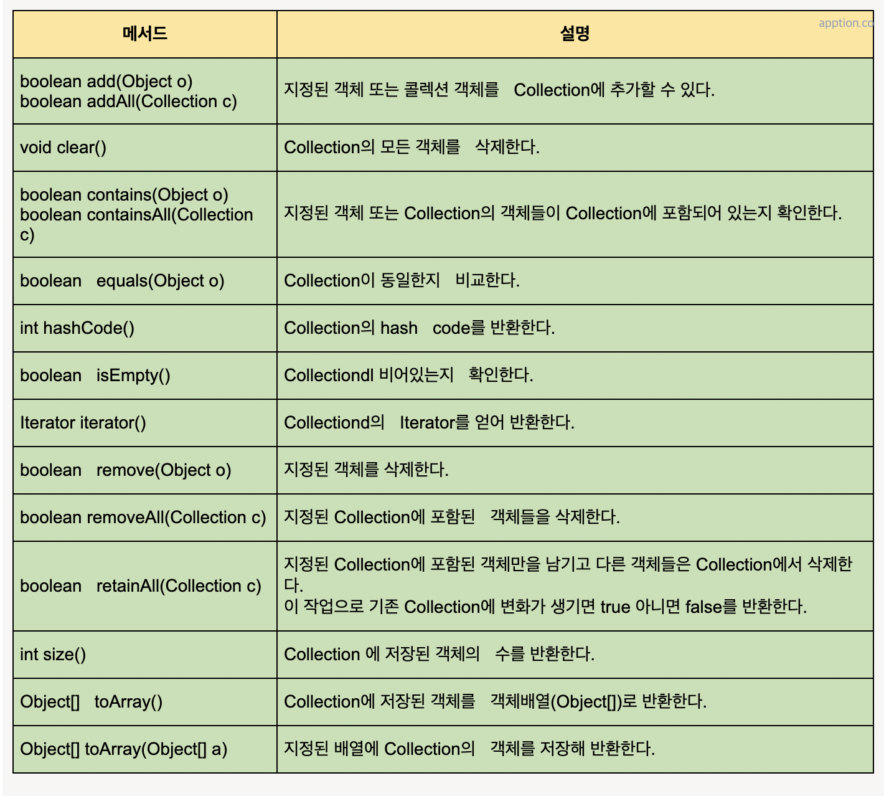

### List 인터페이스

- 중복을 허용하면서 저장순서가 유지되는 컬렉션을 구현하는데 사용된다.


- Collection 인터페이스 상속받은 메서드를 제외한 정의된 메서드

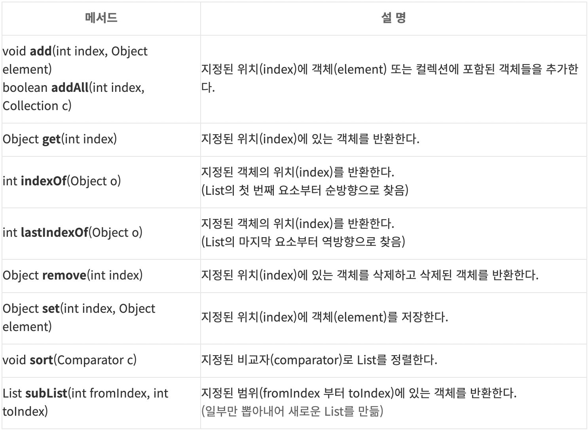

### Set 인터페이스

- 중복을 허용하지 않고 저장순서가 유지되지 않는 컬렉션 클래스를 구현하는데 사용
- 구현한 클래스로는 HashSet, TreeSet 등이 있다.

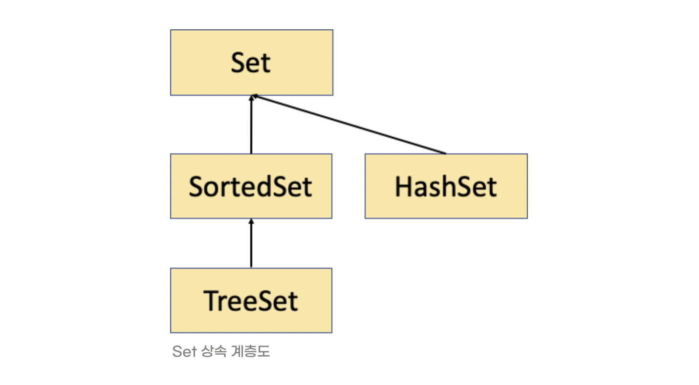

### Map 인터페이스

- 키와 값을 하나의 쌍(key - value)으로 묶어서 저장하는 컬렉션 클래스를 구현하는데 사용
    - 키는 중복될 수 없다.
    - 값은 중복을 허용한다.
- 기존에 저장된 데이터와 중복된 키와 값을 저장하면 기존의 값은 없어지고 마지막에 저장된 값이 남게 된다.
- 구현한 클래스로는 HashTable, HashMap, LinkedHashMap, SortedMap, TreeMap 등이 있다.

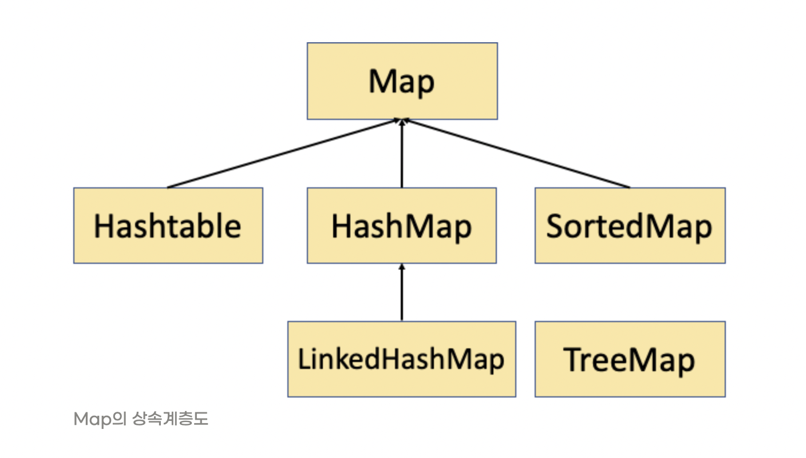

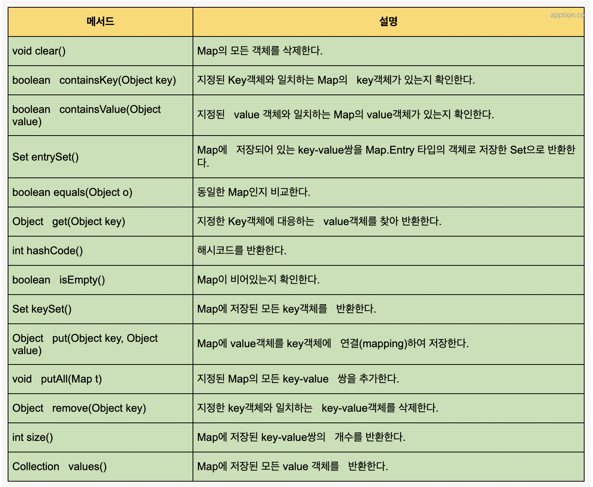

- values()에서는 반환타입이 Collection이고, KeySet()에서는 반환타입이 Set인 것에 주목
    - Map 인터페이스에서 value는 중복을 허용하기 때문에 Collection 타입으로 반환
    - Key는 중복을 허용하지 않기 때문에 Set 타입으로 반환

### Map.Entry 인터페이스

- Map.Entry 인터페이스는 Map 인터페이스의 내부 인터페이스이다.
- 내부 클래스와 같이 인터페이스도 인터페이스 안에 인터페이스를 정희하는 내부 인터페이스(inner interface)를 정의하는 것이 가능하다.
- Map에 저장되는 key-value 쌍을 다루기 위해 내부적으로 Entry 인터페이스를 정의해 놓았다.
    - 이것은 보다 객체지향적으로 설계하도록 유도하기 위한 것
    - Map 인터페이스를 구현하는 클래스에서는 Map.Entry 인터페이스도 함께 구현해야 한다.

```java
public interface Map {
		public static interface Entry {
				Object getKey();
				Object getValue();
				Object setValue(Object value);
				boolean equals(Object o);
				int hashCode();
        ... // jdk8.0 부터 추가된 메서드는 생략

		}
}
```


### ArrayList

- ArrayList는 컬렉션 프레임워크에서 가장 많이 사용되는 컬렉션 클래스일 것이다.
- List 인터페이스를 구현하기 때문에 데이터의 저장순서가 유지되고 중복을 허용
- 기존의 Vector를 개선한 것으로 구현원리와 기능적인 측면에서 동일하다고 할 수 있다.
    - 따라서 ArrayList 사용하자
- ArrayList는 Object배열을 이용해서 데이터를 순차적으로 저장한다.
    - 0번째 위치부터 저장되고 배열에 더 이상 공간이 없으면 보다 큰 새로운 배열을 생성해서 기존의 배열에 저장된 내용을 새로운 배열로 복사한 다음에 저장된다
    - 모든 종류의 객체를 담을 수 있다.

        ```java
        public class ArrayList extends AbstractList 
        	implements List, RandomAccess, Cloneable, java.io.Serializable {
        		transient Object[] elementData; // Object 배열
        }
        ```

- 메서드


- exmaple

    ```java
    import java.util.*;

    class ArrayListEx1{
    	public static void main(String[] args) {
    		ArrayList list1 = new ArrayList(10);
    		list1.add(new Integer(5));
    		list1.add(new Integer(4));
    		list1.add(new Integer(2));
    		list1.add(new Integer(0));
    		list1.add(new Integer(1));
    		list1.add(new Integer(3));

    		ArrayList list2 = new ArrayList(list1.subList(1,4)); 
    		print(list1, list2);

    		Collections.sort(list1);	// list1과 list2를 정렬한다.
    		Collections.sort(list2);	// Collections.sort(List l)
    		print(list1, list2);

    		System.out.println("list1.containsAll(list2):" + list1.containsAll(list2));

    		list2.add("B");
    		list2.add("C");
    		list2.add(3, "A");
    		print(list1, list2);

    		list2.set(3, "AA");
    		print(list1, list2);
    		
    		// list1에서 list2와 겹치는 부분만 남기고 나머지는 삭제한다.
    		System.out.println("list1.retainAll(list2):" + list1.retainAll(list2));	
    		print(list1, list2);
    		
    		//  list2에서 list1에 포함된 객체들을 삭제한다.
    		for(int i= list2.size()-1; i >= 0; i--) {
    			if(list1.contains(list2.get(i)))
    				list2.remove(i);
    		}
    		print(list1, list2);
    	} // main의 끝

    	static void print(ArrayList list1, ArrayList list2) {
    		System.out.println("list1:"+list1);
    		System.out.println("list2:"+list2);
    		System.out.println();		
    	}
    } // class

    실행결과
    list1[5, 4, 2, 0, 1, 3]
    list2[4, 2, 0]

    list1[0, 1, 2, 3, 4, 5] // Collections.sort(List l)
    list2[0, 2, 4]          // // Collections.sort(List l)

    list1.containsAll(list2) : true
    list1[0, 1, 2, 3, 4, 5]
    list2[0, 2, 4, A, B, C]  // add(Object obj)

    list1[0, 1, 2, 3, 4, 5]
    list2[0, 2, 4, AA, B, C]  // set(int index, Object obj)

    list1.retainAll(list2) : true
    list1[0, 2, 4]
    list2[0, 2, 4, AA, B, C]

    list1[0, 2, 4]
    list2[AA, B, C]      // if contains(): remove()
    ```

- example 2

    ```java
    import java.util.*; 

    class ArrayListEx2 { 
    	public static void main(String[] args) { 
    		final int LIMIT = 10;	// 자르고자 하는 글자의 개수를 지정한다.
    		String source = "0123456789abcdefghijABCDEFGHIJ!@#$%^&*()ZZZ"; 
    		int length = source.length(); 

    		List list = new ArrayList(length/LIMIT + 10); // 크기를 약간 여유 있게 잡는다.

    		for(int i=0; i < length; i+=LIMIT) { 
    			if(i+LIMIT < length ) 
    				list.add(source.substring(i, i+LIMIT)); 
    			else 
    				list.add(source.substring(i)); 
    		} 

    		for(int i=0; i < list.size(); i++) { 
    			System.out.println(list.get(i)); 
    		} 
    	} // main()
    }

    실행결과
    0123456789
    abcdefghij
    ABCDEFGHIJ
    !@#$%^&*()
    ZZZ
    ```

    - ArrayList를 생성할 때, 저장할 요소의 개수를 고려해서 실제 저장할 개수보다 여유 있는 크기로 하는 것이 좋다.
- example 3

    ```java
    import java.util.*;

    class VectorEx1 {
    	public static void main(String[] args) {
    		Vector v = new Vector(5);	// 용량(capacity)이 5인 Vector를 생성한다.
    		v.add("1");
    		v.add("2");
    		v.add("3");
    		print(v);

    		v.trimToSize();	// 빈 공간을 없앤다.(용량과 크기가 같아진다.)
    		System.out.println("=== After trimToSize() ===");
    		print(v);

    		v.ensureCapacity(6);
    		System.out.println("=== After ensureCapacity(6) ===");
    		print(v);

    		v.setSize(7);
    		System.out.println("=== After setSize(7) ===");
    		print(v);
    		
    		v.clear();
    		System.out.println("=== After clear() ===");
    		print(v);
    	}

    	public static void print(Vector v) {
    		System.out.println(v);
    		System.out.println("size :" + v.size());
    		System.out.println("capacity :" + v.capacity());
    	}
    }

    실행결과
    [1, 2, 3]
    size: 3
    capacity: 5
    === after trimToSize() ===
    [1, 2, 3]
    size: 3
    capacity: 3
    === after ensureCapacity(6) ===
    size: 3
    capacity: 6
    === after setSize(7) ===
    size: 7
    capacity: 12  // capacity가 부족한 경우 size를 지정하지 않으면 2배증가
    === after clear() ===
    size: 0
    capacity: 12
    ```

    - Vetor의 용량과 크기에 관한 것
    - 용량을 바꿀때마다 새로운 배열을 생성해서 그 주소값을 할당시키는 것
    - ArrayListsk Vector같이 배열을 이용한 자료구조는 데이터를 읽어오고 저장하는데는 효율이 좋지만, 용량을 변경해야할 때는 새로운 배열을 생성한 후 기존의 배열로부터 새로 생성된 배열로 데이터를 복사해야하기 때문에 상당히 효율이 떨어진다는 단점을 가지고 있다.
        - 따라서 용량을 잘 고려해서 충분한 용량의 인스턴스를 생성하는 것이 좋다.
- example 4

    ```java
    import java.util.*;

    public class MyVector implements List {
    	Object[] data = null;	// 객체를 담기 위한 객체배열을 선언한다.
    	int capacity = 0;		// 용량
    	int size = 0;			// 크기

    	public MyVector(int capacity) {
    		if (capacity < 0)
    		   throw new IllegalArgumentException("유효하지 않은 값입니다. :"+ capacity);

    		this.capacity = capacity;
    		data = new Object[capacity];		
    	}

    	public MyVector() {
    		this(10);		// 크기를 지정하지 않으면 크기를 10으로 한다.
    	}

        // 최소한의 저장공간(capacity)를 확보하는 메서드
    	public void ensureCapacity(int minCapacity) {
    		if (minCapacity - data.length > 0)
    			setCapacity(minCapacity);
    	}

    	public boolean add(Object obj) {
    		// 새로운 객체를 저장하기 전에 저장할 공간을 확보한다.
    		ensureCapacity(size+1);
    		data[size++] = obj; 
    		return true;
    	}

    	public Object get(int index) {
    		if(index < 0 || index >= size) 
    			throw new IndexOutOfBoundsException("범위를 벗어났습니다.");

    		return data[index];
    	}

    	public Object remove(int index) { 
    		Object oldObj = null;

    		if(index < 0 || index >= size) 
    			throw new IndexOutOfBoundsException("범위를 벗어났습니다.");

    		oldObj = data[index];

    		// 삭제하고자 하는 객체가 마지막 객체가 아니라면, 배열복사를 통해 빈자리를 채워줘야 한다.
    		if(index != size-1) {
    			System.arraycopy(data, index+1, data, index, size-index-1);
    		}

            // 마지막 데이터를 null로 한다. 배열은 0 부터 시작하므로 마지막 요소는 index가 size-1이다.
    		data[size-1] = null;	
    		size--;
    		return oldObj;
    	}

    	public boolean remove(Object obj) {
    		for(int i=0; i< size; i++) {
    			if(obj.equals(data[i])) {
    				remove(i);
    				return true;
    			}
    		}
    		return false;
    	}

    	public void trimToSize() {
    		setCapacity(size);
    	}

    	private void setCapacity(int capacity) {
    		if(this.capacity==capacity) return; // 크기가 같으면 변경하지 않는다.

    		Object[] tmp = new Object[capacity];
    		System.arraycopy(data,0, tmp, 0, size);
    		data = tmp;
    		this.capacity = capacity;
    	}

    	public void clear(){ 
    		for (int i = 0; i < size; i++)
    			data[i] = null;
    		size = 0;
    	}

    	public Object[] toArray(){ 
    		Object[] result = new Object[size];
    		System.arraycopy(data, 0, result, 0, size);

    		return result;
    	}

    	public boolean isEmpty() { return size==0;}
    	public int capacity() { return capacity; }
    	public int size() { return size; }
    /****************************************/
    /*       List인터페이스로부터 상속받은 메서드들          */
    /****************************************/
    //  public int size();
    //  public boolean isEmpty();
    	public boolean contains(Object o){ return false;}
    	public Iterator iterator(){ return null; }
    //	public Object[] toArray();
    	public Object[] toArray(Object a[]){ return null;}
    //  public boolean add(Object o);
    //  public boolean remove(Object o);
    	public boolean containsAll(Collection c){ return false; }
    	public boolean addAll(Collection c){ return false; }
    	public boolean addAll(int index, Collection c){ return false; }
    	public boolean removeAll(Collection c){ return false; }
    	public boolean retainAll(Collection c){ return false; }
    //	public void clear();
    	public boolean equals(Object o){ return false; }
    //	public int hashCode();
    //  public Object get(int index);
    	public Object set(int index, Object element){ return null;}
    	public void add(int index, Object element){}
    //  public Object remove(int index);
    	public int indexOf(Object o){ return -1;}
    	public int lastIndexOf(Object o){ return -1;}
    	public ListIterator listIterator(){ return null; }
    	public ListIterator listIterator(int index){ return null; }
    	public List subList(int fromIndex, int toIndex){ return null; }

    	default void sort(Comparator c) { /* 내용생략 */ }                     // JDK1.8부터
    	default Spliterator spliterator() { /* 내용생략 */ }                  // JDK1.8부터
    	default void replaceAll(UnaryOperator operator){/* 내용생략 */} //JDK1.8부터
    }
    ```

    - Vector 클래스의 실제코드를 바탕으로 재구성한 것
    - 주석처리한 것은 코드를 정상적으로 동작하도록 구현한 것
    - 주석처리하지 않은 것은 컴파일만 가능하도록 최소한 구현

### LinkedList

- 배열은 가장 기본적인 형태의 자료구조로 구조가 간단하며 사용하기 쉽고 데이터를 읽어오는데 걸리는 시간(access time)이 가장 빠르다는 장점을 가지고 있지만 다음과 같은 단점도 있다.
    1. 크기를 변경할 수 없다.
        - 크기를 변경할 수 없으므로 새로운 배열을 생성해서 데이터를 복사해야한다.
        - 실행속도를 향상시키기 위해서는 충분히 큰 크기의 배열을 생성해야 하므로 메모리가 낭비된다.
    2. 비순차적인 데이터의 추가 또는 삭제에 시간이 많이 걸린다.
        - 차례대로 데이터를 추가하고 마지막에서부터 데이터를 삭제하는 것은 빠르지만,
        - 배열의 중간에 데이터를 추가하려면, 빈자리를 만들기 위해 다른 데이터들을 복사해서 이동해야 한다.
- 이러한 배열의 단점을 보완하기 위해 링크드 리스트라는 자료구조가 고안되었다.
- 배열은 모든 데이터가 연속적으로 존재하지만 링크드 리스트는 불연속적으로 존재하는 데이터를 서로 연결한 형태로 구성되어 있다.

```java
class Node {
		Node next;    // 다음 요소의 주소를 저장
		Object obj;   // 데이터를 저장
}
```

- 링크드 리스트의 삭제
    - 삭제하고자 하는 요소의 이전요소가 삭제하고자 하는 다음 요소를 참조하도록 변경
    - 단 하나의 참조만 변경하면 삭제가 이루어지는 것
    - 따라서 배열처럼 데이터를 이동하기 위해 복사하는 과정이 없기 때문에 처리속도가 매우 빠르다.
- 링크드 리스트의 추가
    - 새로운 요소를 생성한 다음 추가하고자 하는 위치의 이전 요소의 참조를 새로운 요소에 대한 참조로 변경해주고, 새로운 요소가 그 다음 요소를 참조하도록 변경
    - 마찬가지로 참조만 변경하기 때문에 처리속도가 매우 빠르다.
- 링크드 리스트는 이동방향이 단방향이기 때문에 다음 요소에 대한 접근은 쉽지만 이전요소에 대한 접근은 어렵다.
    - 이를 보완한 것이 더블 링크드 리스트
    - 더블 링크드 리스트는 단순히 링크드 리스트에 참조변수를 하나 더 추가하여 이전 요소에 대한 참조가 가능하도록 했을 뿐, 그 외에는 같다.
    - 각 요소에 대한 접근과 이동이 쉽기 때문에 링크드 리스트보다 더 많이 사용된다.

    ```java
    class Node {
    		Node next;
    		Node previous; 
    		Object obj;

    }
    ```

- 더블 링크드 리스트의 접근성을 보다 향상시킨 것이 '더블 써큘러 링크드 리스트'인데, 더블 링크드 리스트의 첫 번째 요소와 마지막 요소를 서로 연결시킨 것
    - 실제로 LinkedList 클래스는 이름과 달리 더블 링크드 리스트로 구현되어 있다.
    - 링크드 리스트의 단점인 낮은 접근성을 높이기 위해


- 메서드
    - ArrayList의 메서드 대부분 똑같이 지원
    - LinkedList는 Queue인터페이스와 Deque 인터페이스를 구현하도록 변경되었는데 아래의 22개의 메서드는 Queue인터페이스와 Deque 인터페이스를 구현하면서 추가된 메소드이다.
        - element(), offer(), peek(), poll(), remove() → Queue 인터페이스
        - 나머지 → Deque 인터페이스


### ArrayList vs Linked List 성능차이

- example 1

    ```java
    import java.util.*; 

    public class ArrayListLinkedListTest { 
          public static void main(String args[]) { 
                // 추가할 데이터의 개수를 고려하여 충분히 잡아야한다.
                ArrayList al = new ArrayList(2000000);
                LinkedList ll = new LinkedList(); 

                System.out.println("= 순차적으로 추가하기 ="); 
                System.out.println("ArrayList :"+add1(al)); 
                System.out.println("LinkedList :"+add1(ll)); 
                System.out.println(); 
                System.out.println("= 중간에 추가하기 ="); 
                System.out.println("ArrayList :"+add2(al)); 
                System.out.println("LinkedList :"+add2(ll)); 
                System.out.println(); 
                System.out.println("= 중간에서 삭제하기 ="); 
                System.out.println("ArrayList :"+remove2(al)); 
                System.out.println("LinkedList :"+remove2(ll)); 
                System.out.println(); 
                System.out.println("= 순차적으로 삭제하기 ="); 
                System.out.println("ArrayList :"+remove1(al)); 
                System.out.println("LinkedList :"+remove1(ll)); 
          } 

          public static long add1(List list) { 
                long start = System.currentTimeMillis(); 
                for(int i=0; i<1000000;i++) list.add(i+""); 
                long end = System.currentTimeMillis(); 
                return end - start; 
          } 

          public static long add2(List list) { 
                long start = System.currentTimeMillis(); 
                for(int i=0; i<10000;i++) list.add(500, "X"); 
                long end = System.currentTimeMillis(); 
                return end - start; 
          } 

          public static long remove1(List list) { 
                long start = System.currentTimeMillis(); 
                for(int i=list.size()-1; i >= 0;i--) list.remove(i); 
                long end = System.currentTimeMillis(); 
                return end - start; 
          } 

          public static long remove2(List list) { 
                long start = System.currentTimeMillis(); 
                for(int i=0; i<10000;i++) list.remove(i); 
                long end = System.currentTimeMillis(); 
                return end - start; 
          } 
    }

    실행결과

    순차적으로 추가하기
    ArrayList : 284
    LinkedList : 406

    중간에서 추가하기
    ArrayList : 3453
    LinkedList : 16

    중간에서 삭제하기
    ArrayList : 2641
    LinkedList : 234

    순차적으로 삭제하기
    ArrayList : 0
    LinkedList : 31
    ```

    1. 순차적으로 추가/삭제하는 경우에는 ArrayList가 LinkedList보다 빠르다.
        - 순차적으로 삭제한다는 것은 마지막 데이터부터 역순으로 삭제해나간다는 것을 의미
        - ArrayList는 자미막 데이터부터 삭제할 경우 각 요소들의 재배치가  필요하지 않기 때문에 상당히 빠르다. 단지 마지막 요소의 값을 null로 바꾸기 때문
        - cf) ArrayList의 크기가 충분히 크지 않다면 느려질 수 있다.
    2. 중간 데이터를 추가/삭제하는 경우에는 LinkedList가 ArrayList보다 빠르다.
        - 중간 요소를 추가 또는 삭제하는 경우, LinkedList는 각 요소간의 연결만 변경해주면 되기 때문에 처리속도가 상당히 빠르다.
        - 반면에 ArrayList는 각 요소들을 재배치하여 추가할 공간을 확보하거나 빈 공간을 채워야 하기 때문에 처리속도가 늦다.
- exmaple 2

    ```java
    import java.util.*; 

    public class ArrayListLinkedListTest2 { 
          public static void main(String args[]) { 
                ArrayList  al = new ArrayList(1000000); 
                LinkedList ll = new LinkedList(); 
                add(al);
                add(ll);

                System.out.println("= 접근시간 테스트 ="); 
                System.out.println("ArrayList :"+access(al)); 
                System.out.println("LinkedList :"+access(ll)); 
    	  }

          public static void add(List list) { 
                for(int i=0; i<100000;i++) list.add(i+""); 
          } 

          public static long access(List list) { 
                long start = System.currentTimeMillis(); 

                for(int i=0; i<10000;i++) list.get(i); 

                long end = System.currentTimeMillis(); 

                return end - start; 
          } 
    }

    실행결과

    = 접근시간 테스트 =
    ArrayList: 1
    LinkedList: 317
    ```

    - 배열의 경우 만일 인덱스가 n인 요소의 값을 얻어 오고자 한다면 단순히 아래의 같은 수식을 계산함으로써 해결 된다.
        - 인덱스가 n인 데이터의 주소 = 배열의 주소 + n * 데이터 타입의 크기
        - 배열은 각 요소들이 연속적으로 메모리상에 존재하기 때문에
    - 하지만 LinkedList는 불연속적으로 위치한 각 요소들이 서로 연결된 것이라 처음부터 n번째 데이터까지 차례대로 따라가야만 원하는 값을 얻을 수 있다.
        - 따라서 저장해야하는 데이터의 개수가 많아질수록 데이터를 읽어 오는 시간, 접근시간이 길어진다는 단점이 있다.
- 결론


    - 다루고자 하는 데이터의 개수가 변하지 않는 경우면, ArrayList가 최상의 선택
    - 데이터의 개수의 변경이 잦다면 LinkedList가 더 나은 선택
    - 두 클래스의 장점을 이용해서 할 수도 있다.
        - 처음에는 데이터를 저장할때는 ArrayList
        - 작업할 때는 LinkedList에 데이터를 옮겨서 작업
        - 컬렉션  프레임워크에 속한 대부분의 컬렉션 클래스들은 이처럼 서로 변환히 가능한 생성자를 제공하므로 간단히 다른 컬렉션 클래스로 데이터를 옮길 수 있다.

        ```java
        ArrayList al = new ArrayList(1000000);
        for(int i=0; i<1000000; i++) al.add(i+"");

        LinkedList ll = new LinkedList(al);
        for(int i=0; i<1000000; i++) ll.add(500, "X");
        ```

### Stack과 Queue

- 스택은 LIFO 구조
- 큐는 FIFO 구조
- 스택과 큐를 구현하기 위해서는 어떤 컬렉션 클래스를 사용하는 것이 좋을까?
    - 순차적으로 데이터를 추가하고 삭제하는 스택에는 ArrayList가 적합하지만
    - 큐는 데이터를 꺼낼 때 항상 첫 번째 저장된 데이터를 삭제하므로, 배열기반의 컬렉션 클랙스를 사용한다면 데이터를 꺼낼 때마다 빈 공간을 채우기 위해 데이터의 복사가 발생하므로 비효율
    - 따라서 큐는 데이터의 추가/삭제가 쉬운 LinkedList
- 지원 메서드
    - stack
        - 추가 : push
        - 삭제 : pop
        - 맨 위 조회: peek
        - 조회: search

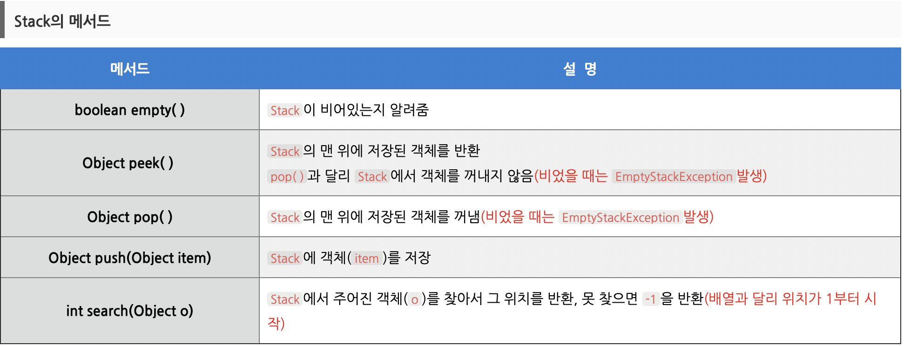

    - queue
        - 추가 : add vs offer
        - 삭제 : remove vs poll
        - 맨 앞 조회 : element vs peek

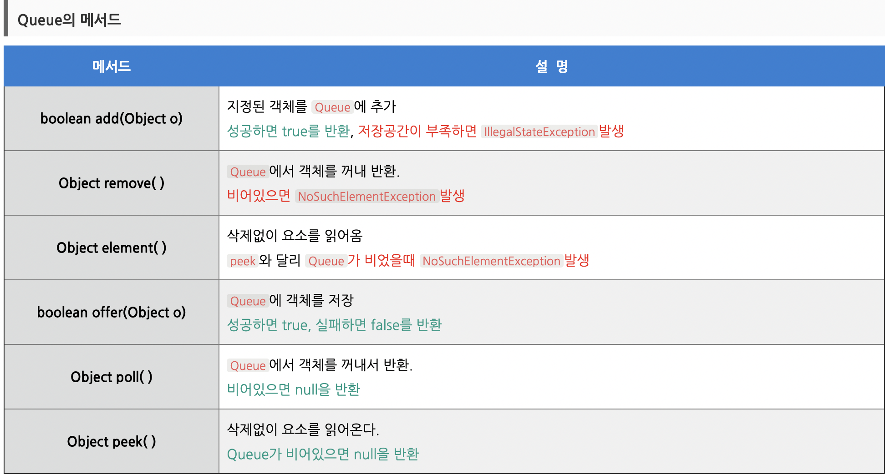

- example

    ```java
    import java.util.*;

    class StackQueueEx {
    	public static void main(String[] args) {
    		Stack st = new Stack();
    		Queue q = new LinkedList();	 // Queue인터페이스의 구현체인 LinkedList를 사용
    		
    		st.push("0");
    		st.push("1");
    		st.push("2");

    		q.offer("0");
    		q.offer("1");
    		q.offer("2");

    		System.out.println("= Stack =");
    		while(!st.empty()) {
    			System.out.println(st.pop());
    		}

    		System.out.println("= Queue =");
    		while(!q.isEmpty()) {
    			System.out.println(q.poll());
    		}
    	}
    }

    실행결과
    stack
    2
    1
    0
    queue
    0
    1
    2
    ```

    - 자바에서는 스택을 Stack 클래스로 구현하여 제공하고 있지만
    - 큐는 Queue 인터페이스로만 정의해 놓았을 뿐 별도의 클래스를 제공하고 있지 않다.
        - 대신 Queue 인터페이스를 구현한 클래스들이 있어서 이 들 중의 하나를 선택해서 사용
        - 자바 api문서에서 All Know implementing Classes 항목에 확인 가능

### 스택 직접 구현

- example

    ```java
    import java.util.*;

    class MyStack extends Vector {
        public Object push(Object item) {
    			addElement(item);
    			return item;
        }

        public Object pop() {
    			Object obj = peek();	 // Stack에 저장된 마지막 요소를 읽어온다.
    			//   만일 Stack이 비어있으면 peek()메서드가 EmptyStackException을 발생시킨다.
    	    //   마지막 요소를 삭제한다. 배열의 index가 0 부터 시작하므로 1을 빼준다.
    			removeElementAt(size() - 1); 
    			return obj;
        }

        public Object peek() {
    			int	len = size();
    	
    			if (len == 0)
    				throw new EmptyStackException();
    	        // 마지막 요소를 반환한다. 배열의 index가 0 부터 시작하므로 1을 빼준다.
    			return elementAt(len - 1);	
        }

        public boolean empty() {
    			return size() == 0;
    	    }
        
        public int search(Object o) {
    			int i = lastIndexOf(o);	// 끝에서부터 객체를 찾는다. 
    			// 반환값은 저장된 위치(배열의 index)이다.
    			if (i >= 0) { // 객체를 찾은 경우
    				return size() - i; // Stack은 맨 위에 저장된 객체의 index를 1로 정의하기 때문에
    	                         // 계산을 통해서 구한다.
    			}
    			return - 1;		// 해당 객체를 찾지 못하면 -1를 반환한다.
    	}
    }
    ```

### 스택과 큐의 활용

- 스택의 활용 예
    - 수식계산, 수식괄호검사, 워드프로세서의 undo/redo, 웹브라우저의 뒤로/앞으로
- 큐의 활용 예
    - 최근사용문서, 인쇄작업 대기목록, 버퍼
- example

    ```java
    import java.util.*;

    public class StackEx1 {
    	public static Stack back    = new Stack();
    	public static Stack forward = new Stack();  

    	public static void main(String[] args) {
    		goURL("1.네이트");
    		goURL("2.야후");
    		goURL("3.네이버");
    		goURL("4.다음");

    		printStatus();

    		goBack();
    		System.out.println("= 뒤로가기 버튼을 누른 후 =");  
    		printStatus();

    		goBack();
    		System.out.println("= '뒤로' 버튼을 누른 후 =");  
    		printStatus();

    		goForward();
    		System.out.println("= '앞으로' 버튼을 누른 후 =");  
    		printStatus();

    		goURL("codechobo.com");
    		System.out.println("= 새로운 주소로 이동 후 =");  
    		printStatus();
    	}

    	public static void printStatus() {
    		System.out.println("back:"+back);
    		System.out.println("forward:"+forward);
    		System.out.println("현재화면은 '" + back.peek()+"' 입니다.");  
    		System.out.println();
    	}

    	public static void goURL(String url){
    		back.push(url);
    		if(!forward.empty()) 
    			forward.clear();
    	}

    	public static void goForward(){
    		if(!forward.empty())
    			back.push(forward.pop());
    	}

    	public static void goBack(){
    		if(!back.empty())
    			forward.push(back.pop());
    	}
    }

    실행결과
    back:[1.네이트, 2.야후, 3.네이버, 4.다음]
    foward:[]
    현재화면은 '4.다음' 입니다.

    = 뒤로 버튼 누른 후 =
    back:[1.네이트, 2.야후, 3.네이버]
    foward:[4.다음]
    현재화면은 '3.네이버' 입니다.

    = 뒤로 버튼 누른 후 =
    back:[1.네이트, 2.야후]
    foward:[4.다음, 3.네이버]
    현재화면은 '2.야후' 입니다.

    = 앞으로 버튼 누른 후 =
    back:[1.네이트, 2.야후, 3.네이버]
    foward:[4.다음]
    현재화면은 '3.네이버' 입니다.

    = 새로운 주소로 이동후 =
    back:[1.네이트, 2.야후, 3.네이버, codechobo.com]
    foward:[]
    현재화면은 'codechobo.com' 입니다.
    ```

### PriorityQueue

- Queue 인터페이스의 구현체 중의 하나로, 저장한 순서에 관계없이 우선순위가 높은 것부터 꺼내게 된다는 특징이 있다.
- null은 저장할 수 없다.
- 저장공간을 배열을 사용하며, 각 요소를 'heap'이라는 자료구조의 형태로 저장한다.
    - 힙은 잠시 후에 배울 이진 트리의 한 종류로 가장 큰 값이나 가장 작은 값을 빠르게 찾을 수 있다는 특징이 있다.

```java
import java.util.*;

class PriorityQueueEx {
	public static void main(String[] args) {
		Queue pq = new PriorityQueue();
		pq.offer(3);  // pq.offer(new Integer(3)); 오토박싱
		pq.offer(1);
		pq.offer(5);
		pq.offer(2);
		pq.offer(4);

		System.out.println(pq); // pq의 내부 배열을 출력

		Object obj = null;

		// PriorityQueue에 저장된 요소를 하나씩 꺼낸다.
		while((obj = pq.poll())!=null) 
			System.out.println(obj);
	}
}
```

### Deque(Double-Ended Queue)

- Queue의 변형으로, 한 쪽 끝으로만 추가/삭제할 수 있는 큐와 달리, 덱(디큐)은 양쪽 끝에 추가/삭제가 가능하다.
- 덱의 조상은 큐이며, 구현체로는 ArrayDeque과 LinkedList 등이 있다.
- 덱은 스택과 큐를 하나로 합쳐놓은 것과 같으며 스택으로 사용할 수도 있고, 큐로 사용할 수도 있다.

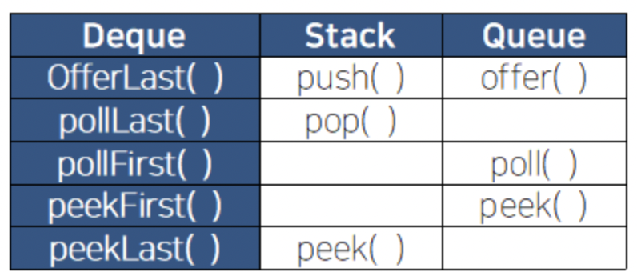

### Iterator, ListIterator, Enumeration

- Iterator, ListIterator, Enumeration은 모두 컬렉션에 저장된 요소를 접근하는데 사용되는 인터페이스이다.
- Enumeration은 Iterator의 구버젼이며, ListIterator은 Iterator의 기능을 향상 시킨 것이다.

### Iterator

- 컬렉션 프레임워크에서는 컬렉션에 저장된 요소들을 읽어오는 방법을 표준화하였다.
- 컬렉션에 저장된 각 요소에 접근하는 기능을 가진 Iterator 인터페이스를 정의하고, Collection 인터페이스에는 'Iterator(Iterator를 구현한 클래스의 인스턴스)'를 반환하는 iterator()를 정의하고 있다.

```java
public interface Iterator {
		boolean hasNext();
		Object next();
		void remove();
}

public interface Collection {
		public Iterator iterator();
}
```

- iterator()는 Collection 인터페이스에 정의된 메서드이므로 Collection 인터페이스의 자손인 List와 Set에도 포함되어 있다.
- 그래서 List나 Set 인터페이스를 구현하는 컬렉션은 iterator()가 각 컬렉션의 특징에 알맞게 작성되어 있다.
- 컬렉션 클래스에 대해 iterator()를 호출하여 iterator를 얻은 다음, 반복문, 주로 while문을 사용해서 컬렉션 클래스의 요소들을 읽어 올 수 있다.

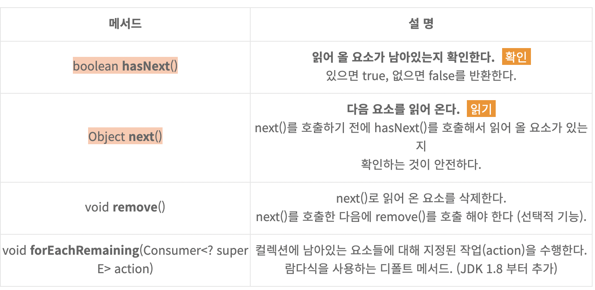

- exmaple

    ```java
    Collection c = new ArrayList(); // 다른 컬렉션으로 변경시 이 부분만 고치면 된다.
    Iterator it = c.iterator();

    while(it.hasNext()) {
    		Sytem.out.println(it.next());
    }
    ```

    - 참조변수를 Collection 타입으로 하는 이유
        - Collection에 없고 ArrayList에만 있는 메서드를 사용하는게 아니라면, Collection타입의 참조변수로 선언하는 것이 좋다.
        - 만일 Collection인터페이스를 구현한 다른 클래스로 바꿔야 한다면, 선언문 하나만 변경하면 되지만
        - 참조변수가 ArrayList였다면 선언문 이후의 문장들도 검토해야하기 때문
- Map 인터페이스를 구현한 컬렉션 클래스는 키(key)와 값(value)를 쌍으로 저장하고 있기 때문에 iterator()를 직접 호출할 수 없고, 그 대신 keySet()이나 entrySet()과 같은 메서드를 통해서 키와 값을 각각 따로 Set의 형태로 얻어 온 후에 다시 iterator()를 호출해야 Iterator를 얻을 수 있다.

    ```java
    Map map = new HashMap();
    Iterator it = map.entrySet().iterator();
    ```

- example2

    ```java
    import java.util.*;

    class IteratorEx1 {
    	public static void main(String[] args) {
    		ArrayList list = new ArrayList();
    		list.add("1");
    		list.add("2");
    		list.add("3");
    		list.add("4");
    		list.add("5");

    		Iterator it = list.iterator();
    		while(it.hasNext()) {
    			Object obj = it.next();
    			System.out.println(obj);
    		}
    	} // main
    }

    실행결과
    1
    2
    3
    4
    5
    ```

    - List 클래스들은 저장순서를 유지하기때문에 Iterator를 이용해서 읽어 온 결과 역시 저장 순서와 동일하지만
    - Set 클래스들은 각 요소간의 순서가 유지 되지 않기 때문에 Iterator를 이용해서 저장된 요소들을 읽어 와도 처음에 저장된 순서와 같지 않다.

### ListIterator와 Enumeration

- Enumeration은 컬렉션 프레임워크가 만들어지기 이전에 사용하던 것으로 Iterator의 구버젼이라고 생각하면 된다.
    - Enumeration 대신 Iterator를 사용하자
- ListIterator는 Iterator를 상속받아서 기능을 추가한 것으로, 컬렉션의 요소에 접근할 때 Iterator는 단방향으로 이동할 수 있는데 반해 ListIterator는 양방향으로의 이동이 가능하다.
    - 하지만 ArrayList나 LinkedList와 같이 List 인터페이스를 구현한 컬렉션에서만 사용 가능
- 결론
    - Enumeration: Iterator의 구버젼


    - ListIterator: Iterator에 양방향 조회기능추가(List를 구현한 경우만 사용가능)

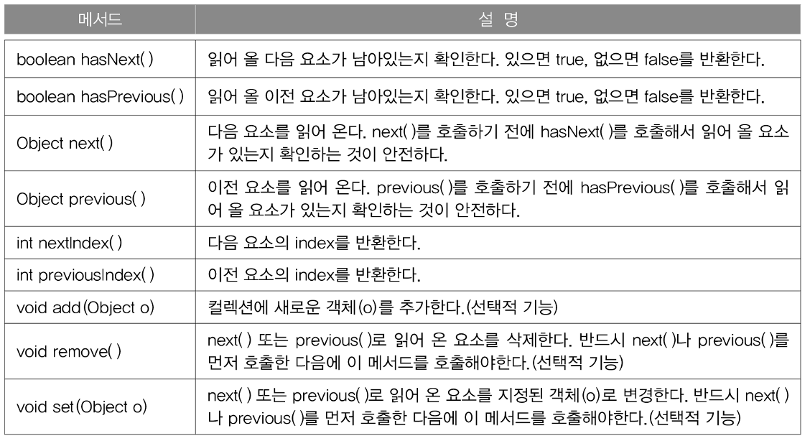

        ```java
        import java.util.*;

        class ListIteratorEx1 {
        	public static void main(String[] args) {
        		ArrayList list = new ArrayList();
        		list.add("1");
        		list.add("2");
        		list.add("3");
        		list.add("4");
        		list.add("5");

        		ListIterator it = list.listIterator();

        		while(it.hasNext()) {
        			System.out.print(it.next()); // 순방향으로 진행하면서 읽어온다.
        		}
        		System.out.println();

        		while(it.hasPrevious()) {
        			System.out.print(it.previous()); // 역방향으로 진행하면서 읽어온다.
        		}
        		System.out.println();
        	}
        }

        실행결과
        12345
        54321
        ```

        - 이동하기 전에 반드시 hasNext()나 hasPrevious()를 호출해서 이동할 수 있는지 확인해야 한다.
        - 메소드 중에서 선택적 기능이라고  표시된 것들은 반드시 구현하지 않아도 된다. 예를 들어 Iterator인터페이스를 구현하는 클래스에서 remove()는 선택적인 기능이므로 구현하지 않아도 된다.
            - 그렇다하더라도 인터페이스로부터 상속받은 메서드는 추상메서드라 메서드의 body를 반드시 만들어 주어야 하므로 다음과 같이 처리한다.

            ```java
            public void remove() {
            		throw new UnsupportedOpeationException();
            }
            ```

            - 단순히 public void remove() {}; 와 같이 구현하는 것보다 이처럼 예외를 던져서 구현되지 않은 기능이라는 것을 메서드에 호출하는 쪽에 알리는 것이 좋다.
            - 그렇지 않으면 호출 하는 쪽에서는 소스를 구해보기 전까지는 이 기능이 바르게 동작하지 않는 이유를 알 방법이 없다.

- example

    ```java
    import java.util.*;

    public class IteratorEx2 {
    	public static void main(String[] args) {
    		ArrayList original = new ArrayList(10);
    		ArrayList copy1    = new ArrayList(10);		
    		ArrayList copy2    = new ArrayList(10);		
    		
    		for(int i=0; i < 10; i++)
    			original.add(i+"");

    		Iterator it = original.iterator();
    		
    		while(it.hasNext())
    			copy1.add(it.next());

    		System.out.println("= Original에서 copy1로 복사(copy) =");		
    		System.out.println("original:"+original);
    		System.out.println("copy1:"+copy1);
    		System.out.println();

    		it = original.iterator(); // Iterator는 재사용이 안되므로, 다시 얻어와야 한다.
    		
    		while(it.hasNext()){
    			copy2.add(it.next());
    			it.remove();
    		}
    		
    		System.out.println("= Original에서 copy2로 이동(move) =");		
    		System.out.println("original:"+original);
    		System.out.println("copy2:"+copy2);		
    	} // main
    } // class

    실행결과

    original에서 copy1로 복사
    [0 1 2 3 4 5 6 7 8]
    [0 1 2 3 4 5 6 7 8]

    original에서 copy2로 복사
    []
    [0 1 2 3 4 5 6 7 8]
    ```

- example 2

    ```java
    import java.util.*;

    public class MyVector2 extends MyVector implements Iterator {
    	int cursor  = 0;
    	int lastRet = -1;
    	
    	public MyVector2(int capacity) {
    		super(capacity);		
    	}
    	
    	public MyVector2() {
    		this(10);		
    	}

    	public String toString() {
    		String tmp = "";
    		Iterator it = iterator();

    		for(int i=0; it.hasNext();i++) {
    			if(i!=0) tmp+=", ";
    			tmp += it.next(); 	// tmp += next().toString();
    		}

    		return "["+ tmp +"]";		
    	}

    	public Iterator iterator() {
    		cursor=0;		// cursor와 lastRet를 초기화 한다.
    		lastRet = -1;
    		return this;		
    	}	
    	
    	public boolean hasNext() {
    	    return cursor != size();
    	}
    	
        public Object next(){
    		Object next = get(cursor);
    		lastRet = cursor++;
    		return next;
        }
    	
    	public void remove() {
             // 더이상 삭제할 것이 없으면 IllegalStateException를 발생시킨다.
    		if(lastRet==-1) {  
    			throw new IllegalStateException();
    		} else {
    			remove(lastRet);
    			cursor--;           // 삭제 후에 cursor의 위치를 감소시킨다.
    			lastRet = -1;		// lastRet의 값을 초기화 한다.	
    		}
    	}		
    } // class
    ```

    - cursor는 앞으로 읽어 올 요소의 위치 저장
    - lastRet는 마지막으로 읽어 온 요소의 위치 저장
        - 따라서 lastRet는 cursor보다 항상 1이 작은 값
    - remove()를 호출하면 next()를 통해서 읽은 위치의 요소, 즉 lastRet에 저장된 값의 위치에 있는 요소 삭제하고 lastRet을 -1로 초기화
        - 만약 next()를 호출하지 않고 remove()호출하면 예외
    - remove()를 호출해서 lastRet 위치에 있는 객체를 삭제한 다음에 cursor의 값을 감소시킨다
        - 그 이유는 객체를 삭제하고 나면, 삭제된 위치 이후의 객체들이 빈 공간을 채우기 위해 자동적으로 이동되기 때문에 cursor의 위치도 같이 이동시켜주어야 한다.
        - 그리고 읽어온 요소가 삭제되었으므로 읽어온 요소의 위치를 저장하는 lastRet의 값은 -1로 초기화해야 한다.

    ```java
    import java.util.*;

    class MyVector2Test {
    	public static void main(String args[]) {
    		MyVector2 v = new MyVector2();
    		v.add("0");
    		v.add("1");
    		v.add("2");
    		v.add("3");
    		v.add("4");

    		System.out.println("»èÁ¦ Àü : " + v);
    		Iterator it = v.iterator();
    		it.next();
    		it.remove();
    		it.next();
    		it.remove();

    		System.out.println("»èÁ¦ ÈÄ : " + v);
    	}
    }

    실행결과

    삭제 전 : [0, 1, 2, 3, 4]
    삭제 후 : [2, 3, 4]
    ```

### Arrays

- Arrays 클래스에는 배열을 다루는데 유용한 메서드가 정의되어 있다.
- 모두 static 메서드이다.
- 모든 기본형 배열과 참조형 배열 별로 오버로딩 되어있다.

### 배열의 복사 - copyOf(), copyOfRange()

- copyOf()는 배열 전체를
- copyOfRange()는 배열의 일부를 복사해서 새로운 배열을 만들어 반환한다.
    - 늘 그렇듯이 지정된 범위의 끝은 포함되지 않는다.

```java
int[] arr = {0, 1, 2, 3, 4};
int[] arr2 = Arrays.copyOf(arr, arr.length); // arr2 = [0,1,2,3,4]
int[] arr3 = Arrays.copyOf(arr, 3); // arr3 = [0,1,2]
int[] arr4 = Arrays.copyOfRange(arr, 2, 4); // arr4 = [2, 3]
int[] arr5 = Arrays.copyOfRange(arr, 0, 7); // arr5 = [0,1,2,3,4,0,0]
```

### 배열 채우기 - fill(), setAll()

- fill()은 배열의 모든 요소를 지정된 값으로 채운다.
- setAll()은 배열을 채우는데 사용할 함수형 인터페이스를 매개변수로 받는다.
    - 이 메서드를 호출할 때는 함수형 인터페이스를 구현한 객체를 매개변수로 지정하던가 아니면 람다식을 지정해야 한다.

    ```java
    int[] arr = new int[5];
    Arrays.fill(arr, 9); // arr = [9,9,9,9,9]
    Arrays.setAll(arr, () -> (int)(Math.random()*5)+1); // arr = [1,5,2,1,1]
    ```

    - 위의 문장에서 사용된 'i → (int)(Math.random()*5)+1)'은 람다식인데, 1~5의 범위에 속한 임의의 정수를 반환하는 일을 한다.
    - setAll()메서드는 이 람다식이 반환한 임의의 정수로 배열을 채운다.

### 배열의 정렬과 검색 - sort(), binarySearch()

- sort()는 배열을 정렬할 때
- binarySearch()는 배열에 저장된 요소를 검색할 때 사용한다
    - 배열에서 지정된 값이 저장된 위치(index)를 찾아서 반환
    - 이진탐색이므로 배열이 정렬된 상태이어야 올바른 결과를 얻는다.
    - 만약 일치하는 요소들이 여러 개 있다면, 이중에서 어떤 것의 위치가 반환될지는 알 수 없다.

```java
int[] arr = {3,2,0,1,4};
int idx = Arrays.binarySearch(arr, 2); // -5, 잘못된 결과

Arrays.sort(arr);
int idx = Arrays.binarySearch(arr, 2); // 2, 올바른 결과
```

### 배열의 비교와 출력 - equals(), toString()

- toString()배열의 모든 요소를 문자열로 편한게 출력할 수 있다.
    - 일차원 배열에만 사용할 수 있으므로
- 다차원 배열에서는 deepToString()을 사용
    - 배열의 모든 요소를 재귀적으로 접근해서 문자열을 구성하므로 3차원 이상의 배열에도 동작

```java
int[] arr = {0,1,2,3,4};
int[][] arr2D = {{11,22}, {33,44}};

Arrays.toString(arr); // [0, 1, 2, 3, 4]
Arrays.deepToString(arr2D); // [[11, 22], [33, 44]]
```

- equals()는 두 배열에 저장된 모든 요소를 비교해서 같으면 true, 다르면 false
    - 마찬가지로 일차원 배열만 가능
- 다차원 배열에서는 deepEquals() 사용

```java
String[][] str2D = new String[][]{{"aaa", "bbb"}, {"AAA", "BBB"}};
String[][] str2D2 = new String[][]{{"aaa", "bbb"}, {"AAA", "BBB"}};

Arrays.equals(str2D, str2D2); // false
Arrays.equals(str2D, str2D2); // true
```

- 위와 같은 2차원 배열을 equlas()로 비교하면 false인 이유는,
    - 다차원 배열은 '배열의 배열'의 형태로 구성하기 때문에 equals()로 비교하면, 문자열을 비교하는 것이 아니라 '배열에 저장된 배열의 주소'를 비교하게 된다.
    - 주소가 항상 다르므로 false

### 배열을 List로 변환 - asList(Object... a)

- asList()는 배열을 List에 담아서 반환한다.
- 매개변수의 타입이 가변인수라서 배열 생성없이 저장할 요소들만 나열하는 것도 가능하다.

```java
List list = Arrays.asList(new Integer[]{1,2,3,4,5}); // list = [1,2,3,4,5]
List list = Arrays.asList(1,2,3,4,5);  // list = [1,2,3,4,5]
list.add(6); // UnsupportedOperationException 예외 발생
```

- 한 가지 주의할 점은 asList()가 반환한 List의 크기를 변경할 수 없다는 것이다.
    - 즉 추가 또는 삭제가 불가능하다.
    - 저장된 내용 변경은 가능
- 크기를 변경할 수 있는 List가 필요한 경우

    ```java
    List list = new ArrayList(Arrays.asList(1,2,3,4,5));
    ```

### paralleXXX(), spliterator(), stream()

- 이 외에도 'parallel'로 시작하는 이름의 메서드들은 보다 빠른 결과를 얻기 위해 어려 쓰레드가 작업을 나누어 처리하도록 한다.
- spliterator()는 여러 쓰레드가 처리할 수 있게 하나의 작업을 여러 작업으로 나누는 Spliterator를 반환한다.
- stream()은 컬렉션을 스트림으로 변환한다.
- 14장에서 배움

```java
import java.util.*;

class ArraysEx {
	public static void main(String[] args) {
		int[]	arr   =  {0,1,2,3,4};
		int[][] arr2D =  {{11,12,13}, {21,22,23}};

		System.out.println("arr="+Arrays.toString(arr));
		System.out.println("arr2D="+Arrays.deepToString(arr2D));

		int[] arr2 = Arrays.copyOf(arr, arr.length);
		int[] arr3 = Arrays.copyOf(arr, 3);          
		int[] arr4 = Arrays.copyOf(arr, 7);          
		int[] arr5 = Arrays.copyOfRange(arr, 2, 4);  
		int[] arr6 = Arrays.copyOfRange(arr, 0, 7);  

		System.out.println("arr2="+ Arrays.toString(arr2));
		System.out.println("arr3="+ Arrays.toString(arr3));
		System.out.println("arr4="+ Arrays.toString(arr4));
		System.out.println("arr5="+ Arrays.toString(arr5));
		System.out.println("arr6="+ Arrays.toString(arr6));

		int[] arr7 =  new int[5];
		Arrays.fill(arr7, 9);  // arr=[9,9,9,9,9]
		System.out.println("arr7="+Arrays.toString(arr7));

		Arrays.setAll(arr7, i -> (int)(Math.random()*6)+1);
		System.out.println("arr7="+Arrays.toString(arr7));

		for(int i : arr7) {
			char[] graph = new char[i];
			Arrays.fill(graph, '*');
			System.out.println(new String(graph)+i);
		}

		String[][] str2D  = new String[][]{{"aaa","bbb"},{"AAA","BBB"}};
		String[][] str2D2 = new String[][]{{"aaa","bbb"},{"AAA","BBB"}};

		System.out.println(Arrays.equals(str2D, str2D2));      // false
		System.out.println(Arrays.deepEquals(str2D, str2D2));  // true

		char[] chArr = { 'A', 'D', 'C',  'B', 'E' };

		int idx = Arrays.binarySearch(chArr, 'B');
		System.out.println("chArr="+Arrays.toString(chArr));
		System.out.println("index of B ="+Arrays.binarySearch(chArr, 'B'));
		System.out.println("= After sorting =");
		Arrays.sort(chArr);
		System.out.println("chArr="+Arrays.toString(chArr));
		System.out.println("index of B ="+Arrays.binarySearch(chArr, 'B'));
	}
}
```

### Comparator와 Comparable

- Arrays.sort()는 사실 Character 클래스의 Comparable의 구현에 의해 정렬되었던 것이다.
- Comaprator와 Comparable 모두 인터페이스로 컬렉션을 정렬하는데 필요한 메서드를 정의하고 있으며
- Comparable을 구현하고 있는 클래스들은 같은 타입의 인스턴스 끼리 서로 비교할 수 있는 클래스들
    - 주로 Integer와 같은 wrapper클래스와 String, Date, File과 같은 것들이며
    - 기본적으로 오름차순
    - 따라서 Comaprable을 구현한 클래스는 정렬이 가능하다는 것을 의미한다.
- Comparable: 기본 정렬기준을 구현하는데 사용
- Comparator: 기본 정렬기준 외에 다른 기준으로 정렬하고자 할 때 사용
    - 내림차순 또는 다른 기준
- 실제 소스

    ```java
    public interface Comparator {
    		int compare(Object o1, Object o2);
    		boolean equals(Object obj);
    }

    public interface Comparable {
    		public int compareTo(Object o);
    }
    ```

- compare()와 compareTo()는 선언형태와 이름이 다를분 두 객체를 비교하는 같은 기능을 목적으로 고안된 것
    - compareTo()은 int 반환이지만 실제로는 비교하는 두 객체가 같으면 0, 비교하는 값보다 작으면 음수, 크면 양수를 반환하도록 구현해야 한다.
    - compare()도 마찬가지
- 실제 Integer의 코드

    ```java
    public final Integer extends Number implements Comaprable {
    		public int compareTo(Object o) {
    				return compareTo((Integer)o);
    		}
    		public int compareTo(Integer anotherInteger) {
    				int thisVal = this.value;
    				int anotherVal = anotherInteger.value;
    				return thisVal < anotherVal ? -1 : (thisVal == anotherVal ? 0 : 1)
    		}
    }
    ```

- exmaple

    ```java
    import java.util.*;

    class ComparatorEx {
    	public static void main(String[] args) {
    		String[] strArr = {"cat", "Dog", "lion", "tiger"};

    		Arrays.sort(strArr); // String의 Comparable구현에 의한 정렬
    		System.out.println("strArr=" + Arrays.toString(strArr));

    		Arrays.sort(strArr, String.CASE_INSENSITIVE_ORDER); // 대소문자 구분안함
    		System.out.println("strArr=" + Arrays.toString(strArr));

    		Arrays.sort(strArr, new Descending()); // 역순 정렬
    		System.out.println("strArr=" + Arrays.toString(strArr));
    	}
    }

    class Descending implements Comparator { 
    	public int compare(Object o1, Object o2){
    		if( o1 instanceof Comparable && o2 instanceof Comparable) {
    			Comparable c1 = (Comparable)o1;
    			Comparable c2 = (Comparable)o2;
    			return c1.compareTo(c2) * -1 ; // -1을 곱해서 기본 정렬방식의 역으로 변경한다.
    										   // 또는 c2.compareTo(c1)와 같이 순서를 바꿔도 된다.

    		}
    		return -1;
    	} 
    }

    실행결과

    strArr=[Dog, cat, lion, tiger]
    strArr=[cat, Dog, lion, tiger]
    strArr=[tiger, lion, cat, Dog]
    ```

    - Arrays.sort()는 배열을 정렬할 때, Comparator를 지정해주지 않으면 저장하는 객체(주로 Comparable을 구현한 클래스의 객체)에 구현된 내용에 따라 정렬된다.

        ```java
        // 객체 배열에 저장된 객체가 구현한 Comparable에 의한 정렬
        static void sort(Object[] a) 

        // 지정한 Compartor 의한 정렬
        static void sort(Object[] a, Comaprator c)
        ```

    - String의 Comparble 구현은 문자열이 사전 순으로 정렬되도록 작성되어 있다.
        - 오름차순 정렬은 공백, 숫자, 대문자, 소문자의 순으로 정렬되는 것을 의미
        - 정확히 유니코드의 순서가 작은 값에서부터 큰 값으로 정렬
    - 따라서 대소문자를 구분하지 않고 비교하는 Comparator를 상수의 형태로 제공한다.

        ```java
        public static final Comparator CASE_INSENSITIVE_ORDER
        ```

        - 이 Comparator를 이용하면 대소문자 구분없이 정렬할 수 있다.
    - String의 기본 정렬을 반대로 하는 것, 내림차순을 구현하는 것은 compareTo()의 결과에 -1 곱하기만 하거나 비교하는 객체의 위치를 바꿔서 c2.compareTo(c1)과 같이 해도 된다.
        - 다만 compare()의 매개변수가 Object 타입이기 때문에 바로 호출할 수 없으므로 먼저 Comparable로 형변환해야 한다는 것 확인

    ### HashSet

    - HashSet은 Set 인터페이스를 구현한 가장 대표적인 컬렉션이며, Set 인터페이스의 특징대로 중복된 요소를 저장하지 않는다.
    - 새로운 요소를 추가할 때는 add메서드나 addAll 메서드를 사용하는데, 만일 HashSet에 이미 저장되어 있는 요소와 중복된 요소를 추가하고자 한다면 이 메서드들은 false를 반환함으로써 중복된 요소이기 때문에 추가에 실패했다는 것을 알린다.
    - 이러한 HashSet의 특징을 이용하면, 컬렉션 내의 중복 요소들은 쉽게 제거할 수 있다.
    - List인터페이스를 구현한 컬렉션과 달리 저장순서를 유지 하지 않으므로 저장순서를 유지하고자 한다면 LinkedHashSet을 사용해야 한다.
    - cf) HashSet은 HashMap을 이용해서 만들어졌으며, 해싱을 이용해서 해쉬셋이라는 이름이 붙여진 것
    - 메서드


        - load factor는 컬렉션 클래스의 저장공간이 가득 차기 전에 미리 용량을 확보하기 위한 것으로 이 값을 0.8로 지정하면, 저장공간의 80%가 채워졌을 때 용량이 두 배로 늘어난다.
        - 기본값은 0.75
        - 표에는 스트림과 관련된 메서드들은 제외
- example

    ```java
    import java.util.*;

    class HashSetEx1 {
    	public static void main(String[] args) {
    		Object[] objArr = {"1",new Integer(1),"2","2","3","3","4","4","4"};
    		Set set = new HashSet();

    		for(int i=0; i < objArr.length; i++) {
    			set.add(objArr[i]);	// HashSet에 objArr의 요소들을 저장한다.
    		}
        // HashSet에 저장된 요소들을 출력한다.
    		System.out.println(set);	
    	}
    }

    실행결과
    [1, 1, 2, 3, 4]
    ```

    - 중복된 값은 저장되지 않았다.
    - add 메서드는 객체를 추가할 때 이미 같은 객체가 있으면 중복으로 간주하고 저장하지 않는다.
        - 그리고는 작업이 실패했다는 의미로 false를 반환한다.
        - '1'이 두번 출력되었는데 둘 다 '1'로 보이기 때문에 구별이 안되지만, 사실 하나는 String 인스턴스이고 하나는 Integer 인스턴스로 서로 다른 객체이므로 중복으로 간주하지 않는다.
    - 순서를 유지하지 않기 때문에 저장한 순서와 다를수 있다.
        - 중복을 제거하는 동시에 저장한 순서를 유지하고자 한다면 LinkedHashSet 사용
- example2

    ```java
    import java.util.*;

    class HashSetLotto {
    	public static void main(String[] args) {
    		Set set = new HashSet();
    		
    		for (int i = 0; set.size() < 6 ; i++) {
    			int num = (int)(Math.random()*45) + 1;
    			set.add(new Integer(num));
    		}

    		List list = new LinkedList(set);	// LinkedList(Collection c)
    		Collections.sort(list);				// Collections.sort(List list)
    		System.out.println(list);
    	}
    }
    ```

    - Collections 클래스의 sort(List list) 사용
    - 정렬기준을 변경하는 방법은 Collections 클래스에서 공부
- example3

    ```java
    import java.util.*; 

    class Bingo { 
          public static void main(String[] args) { 
                Set set = new HashSet(); 
    //          Set set = new LinkedHashSet(); >> 이거 사용
                int[][] board = new int[5][5]; 

                for(int i=0; set.size() < 25; i++) { 
                      set.add((int)(Math.random()*50)+1+""); 
                } 

                Iterator it = set.iterator(); 

                for(int i=0; i < board.length; i++) { 
                      for(int j=0; j < board[i].length; j++) { 
                            board[i][j] = Integer.parseInt((String)it.next());
                            System.out.print((board[i][j] < 10 ? "  " : " ") + board[i][j]); 
                      } 
                      System.out.println(); 
                } 
          } // main
    }
    ```

    - next()는 Object타입이므로 형변환해서 원래의 타입으로 되돌려 놓아야 한다.
    - 그런데 몇번 실행해보면 같은 숫자가 비슷한 위치에 나온다
    - HashSet은 저장된 순서를 보장하지 않고 자체적인 저장방식에 따라 순서가 결정되기 때문
        - 따라서 이 경우 LinkedHashSet이 더 좋다.
- exmaple4

    ```java
    import java.util.*;

    class HashSetEx3 {
    	public static void main(String[] args) {
    		HashSet set = new HashSet();

    		set.add("abc");
    		set.add("abc");
    		set.add(new Person("David",10));
    		set.add(new Person("David",10));

    		System.out.println(set);
    	}
    }

    class Person {
    	String name;
    	int age;

    	Person(String name, int age) {
    		this.name = name;
    		this.age = age;
    	}

    	public String toString() {
    		return name +":"+ age;
    	}
    }

    실행결과
    [abc, David:10, David:10]
    ```

    - name과 age가 같음에도 불구하고 서로 다른 것으로 인식하여 두번 출력되었다.
    - 어떻게하면 의도대로 같은 것으로 인식하게 할까?

        ```java
        import java.util.*;

        class HashSetEx4 {
        	public static void main(String[] args) {
        		HashSet set = new HashSet();

        		set.add(new String("abc"));
        		set.add(new String("abc"));
        		set.add(new Person2("David",10));
        		set.add(new Person2("David",10));

        		System.out.println(set);
        	}
        }

        class Person2 {
        	String name;
        	int age;

        	Person2(String name, int age) {
        		this.name = name;
        		this.age = age;
        	}

        	public boolean equals(Object obj) {
        		if(obj instanceof Person2) {
        			Person2 tmp = (Person2)obj;
        			return name.equals(tmp.name) && age==tmp.age;
        		}

        		return false;
        	}

        	public int hashCode() {
        		return (name+age).hashCode();
        	}

        	public String toString() {
        		return name +":"+ age;
        	}
        }

        실행결과
        [abc, David:10]
        ```

        - HashSet의 add메서드는 새로운 요소를 추가하기 전에 기존에 저장된 요소와 같은 것인지 판별하기 위해 추가하려는 요소의 equals()와 hashCode()를 호출하기 때문에 equals()와 hashCode()를 목적에 맞게 오버라이딩 해야한다.
        - String 클래스처럼 name과 age가 서로 같으면 true 반환하도록 equals() 오버라이딩
        - String 클래스의 hashCode() 이용해서 오버라이딩
            - jdk 1.8부터 추가된 java.util.Objects 클래스의 hash()를 이용해서 작성하는 것이 좋다.
            - 이 메서드의 괄호 안에 클래스의 인스턴스 변수들을 넣으면 된다.

            ```java
            public int hashCode() {
            		return Objects.hash(name, age);
            }
            ```

        - 오버라이딩 된 hashCode()는 세가지 조건을 만족해야 한다.
            1. 실행 중인 애플리케이션 내의 동일한 객체에 대해서 여러 번 hashCode()를 호출해도 동일한 int 값을 반환해야 한다.
                - 하지만 실행시마다 동일한 int 값을 반환할 필요는 없다(eqauls 메서드의 구현에 사용된 멤버변수의 값이 바뀌지 않았다고 가정한다.)

                 

                ```java
                Person2 p = new Person2("david", 10);
                int hashCode1 = p.hashCode();
                int hashCode2 = p.hashCode();

                p.age = 20;
                int hashCode3 = p.hashCode();

                ```

                - 해쉬코드1과 2는 항상 값이 일치해야하지만 이 두 값이 실행할 때마다 반드시 같은 값일 필요는 없다.
                - 해쉬코드3은 age를 변경한 후에 호출한 결과이므로 1과 2와 달라도 된다.
                - cf) String 클래스는 문자열의 내용으로 해시코드를 만들어 내기 때문에 내용이 같은 문자열에 대한 hashCode()호출은 항상 동일한 해시코드, Object 클래스는 객체의 주소로 해시코드를 만들어 내기 때문에 실행할 때마다 해시코드 값이 달라질 수 있다.
            2. equals 메서드를 이용한 비교에 의해서 true를 얻은 두 객체에 대해 각각 hashCode()호출해서 얻은 결과는 반드시 같아야 한다.
                - p1 p2의 equals 메서드의 결과가 true라면 hashCode1과 2의 값은 같아야 한다는 뜻

                ```java
                Person2 p1 = new Person2("david", 10);
                Person2 p2 = new Person2("david", 10);

                boolean b = p1.equals(p2);

                int hashCode1 = p1.hashCode();
                int hashCode2 = p2.hashCode();
                ```

            3. equals 메서드를 호출했을 때 false를 반환하는 두 객체는 hashCode()호출에 대해 같은 int 값을 반환하는 경우가 있더도 괜찮지만, 해싱을 사용하는 컬렉션의 성능을 향상시키기 위해서는 다른 int 값을 반환하는 것이 좋다.
                - 위의 코드에서 b의 값이 false일지라도 hashCode1과 2의 값이 같은 경우가 발생하는 것을 허용한다.
                - 하지만 해시코드를 사용하는 Hashtable이나 HashMap과 같은 컬렉션의 성능을 높이기 위해서는 가능한 한 서로 다른 값을 반환하도록 hashCode()를 잘 작성해야 한다.
                - 서로 다른 객체에 대해서 해시코드값이 중복되는 경우가 많아질수록 해싱을 사용하는 컬렉션의 검색속도가 떨어진다.
- example5

    ```java
    import java.util.*;

    class HashSetEx5 {
    	public static void main(String args[]) {
    		HashSet setA    = new HashSet();
    		HashSet setB    = new HashSet();
    		HashSet setHab = new HashSet();
    		HashSet setKyo = new HashSet();
    		HashSet setCha = new HashSet();

    		setA.add("1");		setA.add("2");
    		setA.add("3");		setA.add("4");
    		setA.add("5");
    		System.out.println("A = "+setA);

    		setB.add("4");		setB.add("5");
    		setB.add("6");		setB.add("7");
    		setB.add("8");
    		System.out.println("B = "+setB);

    		Iterator it = setB.iterator();
    		while(it.hasNext()) {
    			Object tmp = it.next();
    			if(setA.contains(tmp))
    				setKyo.add(tmp);
    		}

    		it = setA.iterator();
    		while(it.hasNext()) {
    			Object tmp = it.next();
    			if(!setB.contains(tmp))
    				setCha.add(tmp);
    		}

    		it = setA.iterator();
    		while(it.hasNext())
    			setHab.add(it.next());

    		it = setB.iterator();
    		while(it.hasNext())
    			setHab.add(it.next());

    		System.out.println("A ∩ B = "+setKyo);  // 한글 ㄷ을 누르고 한자키
    		System.out.println("A ∪ B = "+setHab);  // 한글 ㄷ을 누르고 한자키
    		System.out.println("A - B = "+setCha); 
    	}
    }

    실행결과
    A = [1,2,3,4,5]
    B = [4,5,6,7,8]
    A 교 B = [4, 5]
    A 합 B = [1,2,3,4,5,6,7,8]
    A - B = [1, 2, 3]
    ```

    - 메서드를 호출하는 것으로 간단하게 할 수 있긴 하다.
    - 합집합 addAll
    - 교집합, retainAll
    - 차집합, removeAl

### TreeSet

- 이진 검색 트리(binary search tree)라는 자료구조의 형태로 데이터를 저장하는 컬렉션 클래스
- 이진 검색 트리는 정렬, 검색, 범위검색에 높은 성능을 보이는 자료구조
- TreeSet은 이진 검색 트리의 성능을 향상시킨 '레드-블랙 트리'로 구현되어 있다.
- Set 인터페이스를 구현했으므로 중복된 데이터의 저장을 허용하지 않으며 정렬된 위치에 저장하므로 저장순서를 유지하지도 않는다.
- 이진 트리는 링크드 리스트처럼 여러개의 노드가 서로 연결된 구조로
    - 각 노드에 최대 2개의 노드를 연결할 수 잇으며
    - 루트라고 불리는 하나의 노드에서부터 시작해서 계속 확장해 나갈 수 있다.
    - 위 아래로 연결된 두 노드를 '부모-자식관계'에 있다고 하며 위의 노드를 부모노드, 아래의 노드를 자식 노드라 한다.
    - 부모 자식 관계는 상대적인 것이며 하나의 부모 노드는 최대  두개의 자식 노드와 연결될 수 있다.

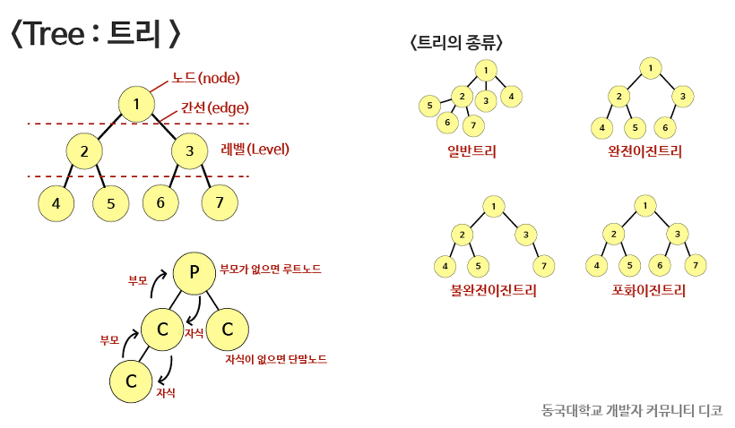

    ```java
    class TreeNode {
    		TreeNode left;
    		Object element;
    		TreeNode right;
    }
    ```

- 이진 검색 트리는 부모노드의 왼쪽에는 부모노드의 값보다 작은 값의 자식노드를, 오른쪽에는 큰 값의 자식노드를 저장하는 이진 트리이다.


- 이진검색 트리의 값 추가 과정
    - 첫 번째로 저장되는 값은 루트가 되고
    - 두 번째 값은 트리의 루트부터 시작해서 값의 크기를 비교하면서 트리를 따라 내려간다
        - 작은 값은 왼쪽에 큰 값은 오른쪽에 저장한다

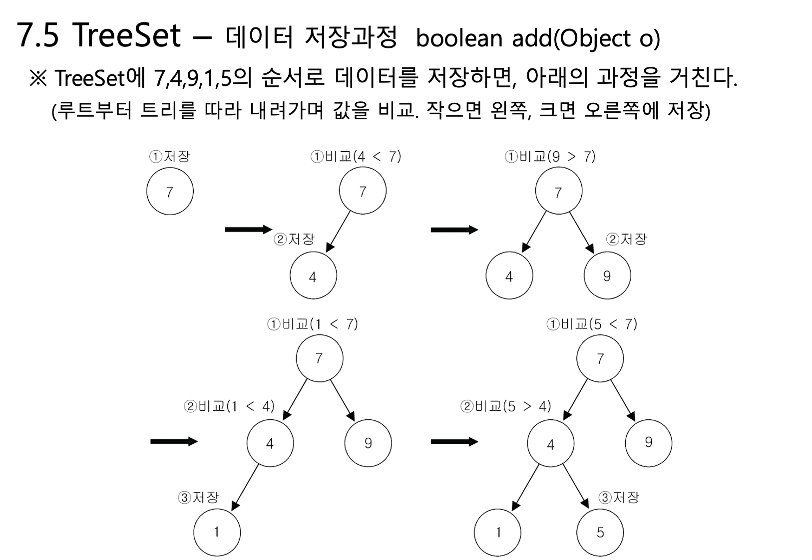

    - 따라서 TreeSet에 저장되는 객체가 Comparable을 구현하던가 아니면 TreeSet에 Compartor를 제공해서 두 객체를 비교할 방법을 알려줘야 한다.
        - 그렇지 않으면 예외가 발생한다
    - 트리셋은 왼쪽 마지막 값에서부터 오른쪽 값까지 값을 '왼쪽 노드 - 부모 노드 - 오른쪽 노드' 순으로 읽어오면 오름차순으로 정렬된 순서를 얻을 수 있다.
        - 이처럼 정렬된 상태를 유지하기 때문에 단일 값 검색과 범위 검색(범위에 있는 값을 검색)이 매우 빠르다.
    - 저장된 값의 개수에 비례해서 검색시간이 증가하긴 하지만 값의 개수가 10배 증가해도 특정 값을 찾는데 필요한 비교횟수가 3~4번만 증가할 정도로 검색효율이 뛰어난 자료구조
    - 트리는 데이터를 순차적으로 저장하는 것이 아니라 저장위치를 찾아서 저장해야하고, 삭제하는 경우 트리의 일부를 재구성해야하므로 링크드 리스트보다 추가/삭제 시간은 더 걸린다.
        - 하지만 배열이나 링크드 리스트에 비해 검색과 정렬 기능이 더 뛰어나다.
    - 결론
        - 모든 노드는 최대 두개의 자식노드를 가질 수 있다.
        - 왼쪽 자식노드 < 부모 노드 < 오른쪽 자식 노드
        - 노드의 추가 삭제에 시간이 걸린다 (순차 저장 x)
        - 검색(범위검색)과 정렬에 유리
        - 중복된 값을 저장 x
    - 메서드

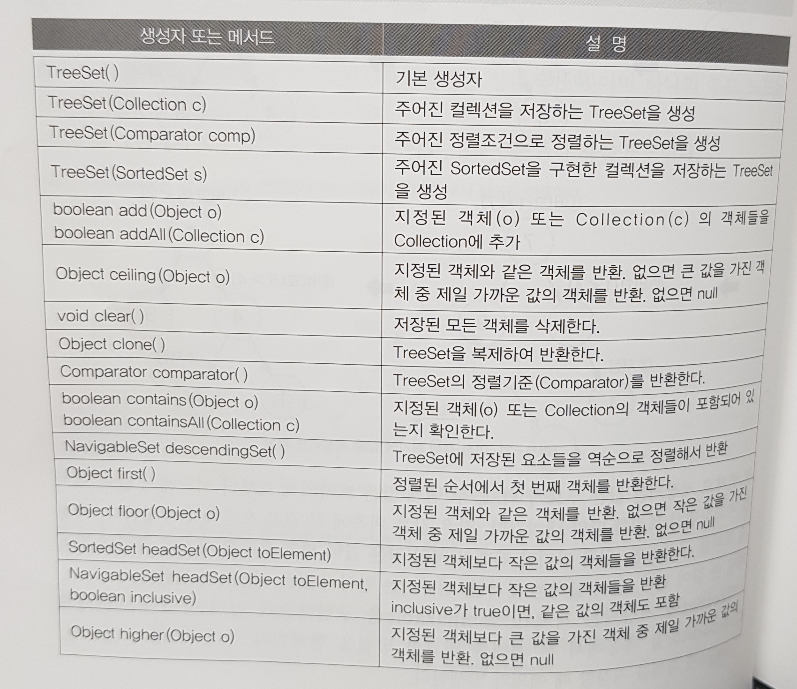


    - exmaple1

        ```java
        import java.util.*;

        class TreeSetLotto {
        	public static void main(String[] args) {
        		Set set = new TreeSet();
        		
        		for (int i = 0; set.size() < 6 ; i++) {
        			int num = (int)(Math.random()*45) + 1;
        			set.add(num);  // set.add(new Integer(num));
        		}

        		System.out.println(set);
        	}
        }

        실행결과
        [5,12,24,26,33,45]
        ```

        - 이전과 달리 정렬하는 코드 작성하지 않아도 삽입할 때 정렬
    - example2

        ```java
        import java.util.*;

        class TreeSetEx1 {
        	public static void main(String[] args) {
        		TreeSet set = new TreeSet();

        		String from = "b";
        		String to	= "d";

        		set.add("abc");
        		set.add("alien");
        		set.add("bat");
        		set.add("car");
        		set.add("Car");
        		set.add("disc");
        		set.add("dance");
        		set.add("dZZZZ");
        		set.add("dzzzz");
        		set.add("elephant");
        		set.add("elevator");
        		set.add("fan");
        		set.add("flower");

        		System.out.println(set);
        		System.out.println("range search : from " + from  +" to "+ to);
        		System.out.println("result1 : " + set.subSet(from, to));
        		System.out.println("result2 : " + set.subSet(from, to + "zzz"));
        	}
        }

        실행결과
        [Car, abc, alien, bat, dZZZZ, dance, disc, dzzzz, elephant, elevator, 
        fan, flower]
        range search: from b to d
        result1: [bat, cat]
        result2: [bat, car, dZZZ, dance, disc]
        ```

        - d로 시작하는 단어 중에서 'dzzz' 다음에 오는 단어는 없을 것이기 때문에 d로 시작하는 모든 단어들이 포함될 것이다.
            - ?? dzzzz는..
        - 대문자가 소문자보다 우선하기 때문에 섞여 있는 경우 의도한것과는 다른 범위검색결과를 얻을 수 있다.
            - 대소문자가 섞여 있거나 다른 방식인 경우 Compartor 이용
        - 문자열의 경우 정렬 순서는 코드값이 기준이 되므로, 크기가 작은 순서에서 큰 순서, 공백, 숫자, 대문자, 소문자 순
            - 내림차순은 반대
        - example3

            ```java
            import java.util.*;

            class TreeSetEx2 {
            	public static void main(String[] args) {
            		TreeSet set = new TreeSet();
            		int[] score = {80, 95, 50, 35, 45, 65, 10, 100};

            		for(int i=0; i < score.length; i++)
            			set.add(new Integer(score[i]));

            		System.out.println("50보다 작은 값 :"	+ set.headSet(new Integer(50)));
            		System.out.println("50보다 큰 값 :"	+ set.tailSet(new Integer(50)));
            	}
            }

            실행결과
            50보다 작은 값: [10, 35, 45]
            50보다 큰 값: [50, 65, 80, 95, 100]
            ```

            - headSet과 tailSet 메서드를 이용하면, TreeSet에 저장된 객체 중 지정된 기준 값 보다 큰 ㄱ밧의 객체들과 작은 값의 객체들을 얻을 수 있다.

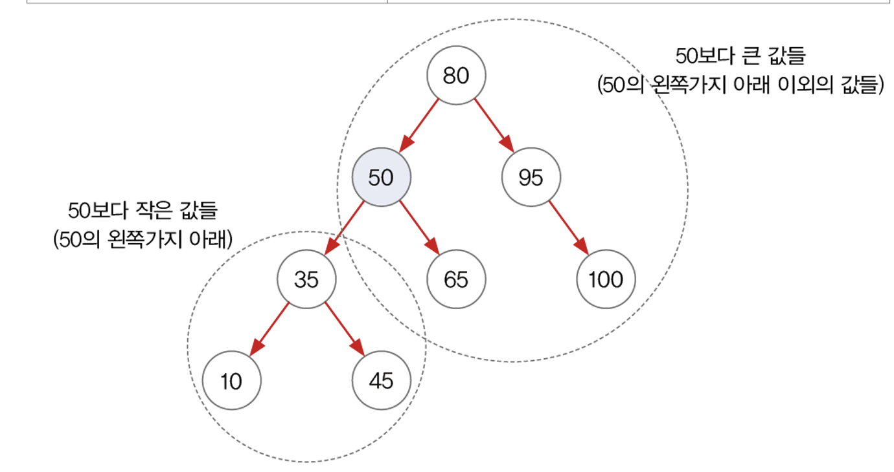

### HashMap과 Hashtable

- Hashtable과 HashMap의 관계는 Vector와 ArrayList의 관계와 같아서 Hashtable보다는 새로운 버전인 HashMap을 사용할 것을 권한다.
- HashMap은 Map을 구현했으므로 앞에서 살펴본 Map의 특징, 키와 값을 묶어서 하나의 데이터(entry)로 저장한다는 특징을 갖는다.
- 그리고 해싱을 사용하기 때문에 많은 양의 데이터를 검색하는데 있어서 뛰어난 성능을 보인다.

```java
public class HashMap extends AbstractMap implements Map, Cloneable,
	Serializable
{
		transient Entry[] table;
		static calss Entry implements Map.Entry {
				final Object key;
				Object value;
		}
}
```

- HashMap은 Entry라는 내부 클래스를 정의하고, 다시 Entry 타입의 배열을 선언하고 있다.
- 키와 값은 별개의 값이 아니라 서로 관련된 값이기 때문에 각각의 배열로 선언하기 보다는 하나의 클래스로 정의해서 하나의 배열로 다루는 것이 데이터의 무결성적인 측면에서 더 바람직하기 때문

- cf) Map.Entry는 Map 인터페이스에 정의된 static inner interface이다.
- HashMap은 키와 값을 각각 Object 타입으로 저장한다.
    - 즉 (Object, Object)의 형태로 저장하기 때문에 어떠한 객체도 저장할 수 있지만 키는 주로 String을 대문자 또는 소문자로 통일해서 사용하곤 한다.
    - 키 : 컬렉션 내의 키 중에서 유일해야 한다.
    - 값 : 키와 달리 데이터의 중복을 허용한다.
- 메서드(책에는 Object clone()도 포함)


    - 람다와 스트림에 관련된 것들은 제외
- example1

    ```java
    import java.util.*;

    class HashMapEx1 {
    	public static void main(String[] args) {
    		HashMap map = new HashMap();
    		map.put("myId", "1234");
    		map.put("asdf", "1111");
    		map.put("asdf", "1234");

    		Scanner s = new Scanner(System.in);	// 화면으로부터 라인단위로 입력받는다.

    		while(true) {
    			System.out.println("id와 password를 입력해주세요.");
    			System.out.print("id :");
    			String id = s.nextLine().trim();

    			System.out.print("password :");
    			String password = s.nextLine().trim();
    			System.out.println();

    			if(!map.containsKey(id)) {
    				System.out.println("입력하신 id는 존재하지 않습니다. 다시 입력해주세요.");
    				continue;
    			} else {
    				if(!(map.get(id)).equals(password)) {
    					System.out.println("비밀번호가 일치하지 않습니다. 다시 입력해주세요.");
    				} else {
    					System.out.println("id와 비밀번호가 일치합니다.");						
    					break;
    				}
    			}
    		} // while
    	} // main의 끝
    }

    실행결과
    id:asdf
    pw: 1111
    비밀번호 불일치

    id:asdf
    pw:1234
    id와 pw일치
    ```

    - 키 'asdf'에 연결된 값은 기존의 값이 덮어씌어져 '1234'가 된다.
    - cf) Hashtable과 달리 HashMap은 키나 값으로 null 허용
- example2

    ```java
    class HashMapEx2 {
    	public static void main(String[] args) {
    		HashMap map = new HashMap();
    		map.put("김자바", new Integer(90));
    		map.put("이자바", new Integer(100));
    		map.put("강자바", new Integer(80));
    		map.put("안자바", new Integer(90));

    		Set set = map.entrySet();
    		Iterator it = set.iterator();

    		while(it.hasNext()) {
    			Map.Entry e = (Map.Entry)it.next();
    			System.out.println("이름 : "+ e.getKey() + ", 점수 : " + e.getValue());
    		}

    		set = map.keySet();
    		System.out.println("참가자 명단 : " + set);

    		Collection values = map.values();
    		it = values.iterator();

    		int total = 0;

    		while(it.hasNext()) {
    			Integer i = (Integer)it.next();
    			total += i.intValue();
    		}

    		System.out.println("총점 : " + total);
    		System.out.println("평균 : " + (float)total/set.size());
    		System.out.println("최고점수 : " + Collections.max(values));
    		System.out.println("최저점수 : " + Collections.min(values));
    	}
    }
    ```

    - enrtySet()을 이용해서 키와 값을 함께 읽어 올 수도 있고 keySet()이나 values()를 이용해서 키와 값을 따로 읽어 올 수 있다.
- example3

    ```java
    class HashMapEx3 {
    	static HashMap phoneBook = new HashMap();

    	public static void main(String[] args) {
    		addPhoneNo("친구", "이자바", "010-111-1111");
    		addPhoneNo("친구", "김자바", "010-222-2222");
    		addPhoneNo("친구", "김자바", "010-333-3333");
    		addPhoneNo("회사", "김대리", "010-444-4444");
    		addPhoneNo("회사", "김대리", "010-555-5555");
    		addPhoneNo("회사", "박대리", "010-666-6666");
    		addPhoneNo("회사", "이과장", "010-777-7777");
    		addPhoneNo("세탁", "010-888-8888");

    		printList();
    	} // main

    	// 그룹을 추가하는 메서드
    	static void addGroup(String groupName) {
    		if(!phoneBook.containsKey(groupName))
    			phoneBook.put(groupName, new HashMap());
    	}

    	// 그룹에 전화번호를 추가하는 메서드
    	static void addPhoneNo(String groupName, String name, String tel) {
    		addGroup(groupName);
    		HashMap group = (HashMap)phoneBook.get(groupName);
    		group.put(tel, name);	// 이름은 중복될 수 있으니 전화번호를 key로 저장한다.
    	}

    	static void addPhoneNo(String name, String tel) {
    		addPhoneNo("기타", name, tel);
    	}

    	// 전화번호부 전체를 출력하는 메서드
    	static void printList() {
    		Set set = phoneBook.entrySet();
    		Iterator it = set.iterator();	

    		while(it.hasNext()) {
    			Map.Entry e = (Map.Entry)it.next();

    			Set subSet = ((HashMap)e.getValue()).entrySet();
    			Iterator subIt = subSet.iterator();	

    			System.out.println(" * "+e.getKey()+"["+subSet.size()+"]");

    			while(subIt.hasNext()) {
    				Map.Entry subE = (Map.Entry)subIt.next();
    				String telNo = (String)subE.getKey();
    				String name = (String)subE.getValue();
    				System.out.println(name + " " + telNo );
    			}
    			System.out.println();
    		}
    	} // printList()
    } // class

    실행결과
    * 기타[1]
    세탁 010-888-8888

    * 친구[3]
    이자바 010-111-1111
    김자바 010-222-2222
    김자바 010-333-3333

    * 회사[4]
    이과장 010-777-7777
    김대리 010-444-4444
    김대리 010-555-5555
    박대리 010-666-6666
    ```

    - HashMap은 데이터를 키와 값을 모두 Object타입으로 저장하기 때문에 HashMap의 값으로 HashMap을 다시 저장할 수 있다.
- example4

    ```java
    import java.util.*;

    class HashMapEx4 {
    	public static void main(String[] args) {
    		String[] data = { "A","K","A","K","D","K","A","K","K","K","Z","D" };

    		HashMap map = new HashMap();

    		for(int i=0; i < data.length; i++) {
    			if(map.containsKey(data[i])) {
    				Integer value = (Integer)map.get(data[i]);
    				map.put(data[i], new Integer(value.intValue() + 1));
    			} else {
    				map.put(data[i], new Integer(1));			
    			}
    		}

    		Iterator it = map.entrySet().iterator();

    		while(it.hasNext()) {
    			Map.Entry entry = (Map.Entry)it.next();
    			int value = ((Integer)entry.getValue()).intValue();
    			System.out.println(entry.getKey() + " : " + printBar('#', value) + " " + value );
    		}
    	} // main

    	public static String printBar(char ch, int value) { 
    		char[] bar = new char[value]; 

    		for(int i=0; i < bar.length; i++) { 
    			bar[i] = ch; 
    		} 

    		return new String(bar); 	// String(char[] chArr)
    	}
    }

    실행결과
    A : ### 3
    B : ## 2
    Z : # 1
    K : ###### 6
    ```

    - 한정된 범위 내에 있는 순차적인 값들의 빈도수는 배열을 이용하지만,
    - 이처럼 한정되지 않은 범위의 비순차적인 값들의 빈도수 HashMap을 이용해서 구할 수 있다.
    - cf) 결과를 보면 알듯이 해싱을 구현한 컬렉션 클래스들은 저장순서를 유지하지 않는다.

### 해싱과 해시함수

- 해싱이란 해시함수(hash function)를 이용해서 데이터를 해시테이블에 저장하고 검색하는 기법을 말한다.
- 해시함수는 데이터가 저장되어 있는 곳을 알려주기 때문에 다량의 데이터 중에서도 원하는 데이터를 빠르게 찾을 수 있다.
- 해싱에서 사용하는 자료구조는 다음과 같이 배열과 링크드 리스트의 조합으로 되어 있다.
- 저장할 데이터의 키를 해시함수에 넣으면 배열의 한 요소를 얻게 되고, 다시 그 곳에 연결되어 있는 링크드 리스트에 저장하게 된다.

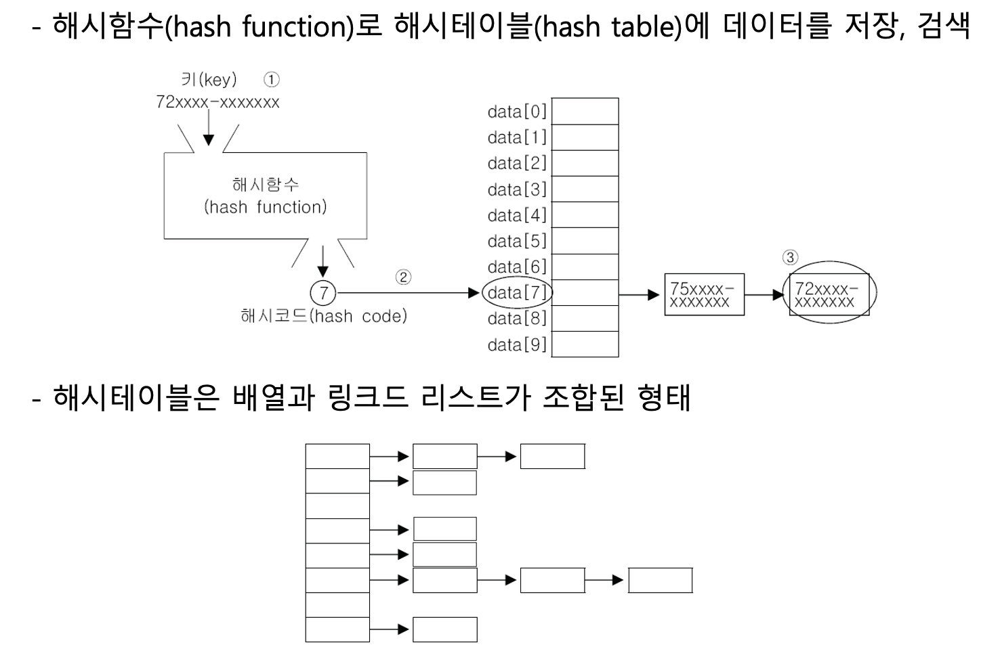

- 배열의 인덱스가 n인 요소의 주소 = 배열의 시작주소 + type의 size * n
- 그래서 해쉬함수로 만든 해시(hashCode, hash)의 성능이 좋아서 한 해쉬에 하나의 데이터만 저장되어 있는 형태가 더 빠른 검색결과를 얻을 수 있다.
- 따라서 하나의 링크드 리스트에 최소한의 데이터만 저장되려면, 저장될 데이터를 크기를 고려해서 HashMap의 크기를 적절하게 지정해주어야 하고
- 해시함수가 서로 다른 키에 대해서 중복된 해시코드의 반환을 최소화해야 한다.
- 그래서 해싱을 구현하는 과정에서 제일 중요한 것은 해시함수의 알고리즘이다.
- 실제 HashMap과 같이 해싱을 구현한 컬렉션 클래스에서는 Object 클래스의 정의된 hashCode()를 해시함수로 사용한다.
    - 객체의 주소를 이용하는 알고리즘으로 해시코드를 만들어내기 때문에 모든 객체에 대해 hashCode()를 호출한 결과가 서로 유일한 훌륭한 방법이다.
- HashSet에서 설명한 것처럼 서로 다른 두 객체에 대해 equals()로 비교한 결과가 true인 동시에 hashCode()의 반환값이 같아야 같은 객체로 인식한다.
    - HashMap도 같은 방법으로 객체를 구별하며, 이미 존재하는 키에 대한 값을 저장하면 기존의 값을 새로운 값으로 덮어쓴다.
    - 그래서 새로운 클래스를 정의할 때 equals()를 재정의오버라이딩해야한다면 hashCode()도 같이 재정의해서 equals()의 결과가 true인 두 객체의 hashCode()의 결과 값이 항상 같도록 해주어야 한다.
    - 그렇지 않으면 HashMap과 같이 해싱을 구현한 컬렉션 클래스에서는 equal()의 호출결과가 true지만 해시코드가 다른 두 객체를 서로 다른 것으로 인식하고 따로 저장할 것이다.
    - cf) equals()로 비교한 결과가 false이고 해시코드가 같은 경우는 같은 링크드 리스트에 저장된 서로 다른 두 데이터가 된다.

### TreeMap

- 이름처럼 이진검색트리의 형태로 키와 값의 쌍으로 이루어진 데이터를 저장한다.
- 그래서 검색과 정렬에 적합한 컬렉션 클래스이다.
- 검색 성능: HashMap > TreeMap
- 범위검색이나 정렬: HashMap < TreeMap
- 메서드

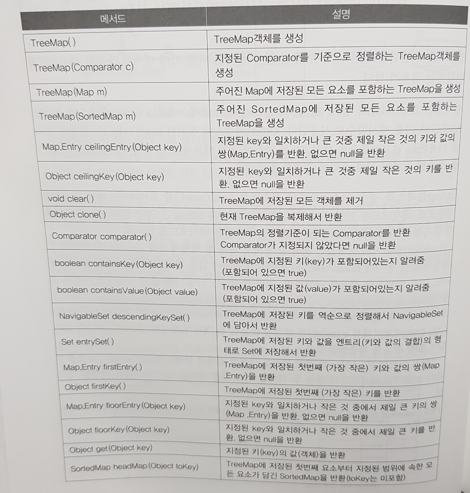

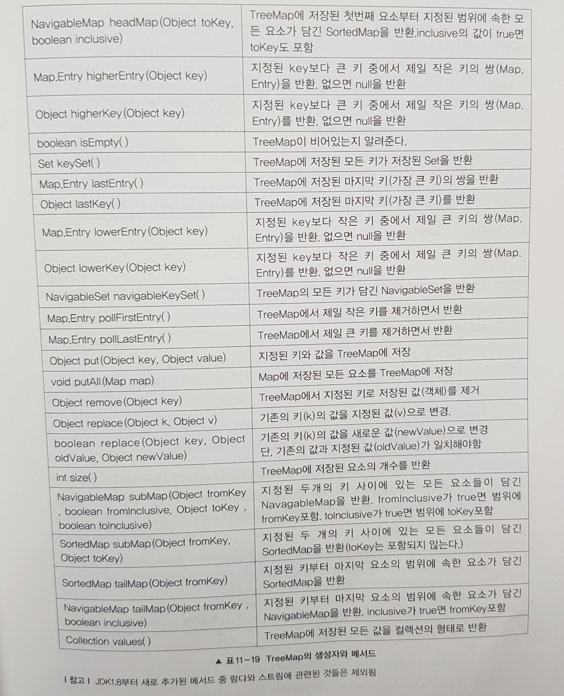

- example1

    ```java
    import java.util.*;

    class TreeMapEx1 {
    	public static void main(String[] args) {
    		String[] data = { "A","K","A","K","D","K","A","K","K","K","Z","D" };

    		TreeMap map = new TreeMap();

    		for(int i=0; i < data.length; i++) {
    			if(map.containsKey(data[i])) {
    				Integer value = (Integer)map.get(data[i]);
    				map.put(data[i], new Integer(value.intValue() + 1));
    			} else {
    				map.put(data[i], new Integer(1));			
    			}
    		}

    		Iterator it = map.entrySet().iterator();

    		System.out.println("= 기본정렬 =");
    		while(it.hasNext()) {
    			Map.Entry entry = (Map.Entry)it.next();
    			int value = ((Integer)entry.getValue()).intValue();
    			System.out.println(entry.getKey() + " : " + printBar('#', value) + " " + value );
    		}
    		System.out.println();

    		// map을 ArrayList로 변환한 다음에 Collectons.sort()로 정렬
    		Set set = map.entrySet();
    		List list = new ArrayList(set);	// ArrayList(Collection c) 
    		
    		// static void sort(List list, Comparator c)  
    		Collections.sort(list, new ValueComparator());

    		it = list.iterator();

    		System.out.println("= 값의 크기가 큰 순서로 정렬 =");		
    		while(it.hasNext()) {
    			Map.Entry entry = (Map.Entry)it.next();
    			int value = ((Integer)entry.getValue()).intValue();
    			System.out.println(entry.getKey() + " : " + printBar('#', value) + " " + value );
    		}

    	} // 	public static void main(String[] args) 

    	static class ValueComparator implements Comparator {
    		public int compare(Object o1, Object o2) {
    			if(o1 instanceof Map.Entry && o2 instanceof Map.Entry) {
    				Map.Entry e1 = (Map.Entry)o1;
    				Map.Entry e2 = (Map.Entry)o2;

    				int v1 = ((Integer)e1.getValue()).intValue();
    				int v2 = ((Integer)e2.getValue()).intValue();

    				return  v2 - v1;
    			} 
    			return -1;
    		}
    	}	// 	static class ValueComparator implements Comparator {

    	public static String printBar(char ch, int value) { 
    		char[] bar = new char[value]; 

    		for(int i=0; i < bar.length; i++) { 
    			bar[i] = ch; 
    		} 

    		return new String(bar); 
    	} 
    }

    실행결과
    == 기본정렬 ==
    A: ### 3
    D: ## 2
    K: ###### 6
    Z: # 1

    = 값의 크기가 큰 순서로 정렬 =
    K: ###### 6
    A: ### 3
    D: ## 2
    Z: # 1
    ```

    - TreeMap을 사용했기 때문에 키가 오름차순으로 정렬되어 있다.
        - 키가 String 인스턴스이기 때문에 String클래스에 정의된 정렬 기준에 의해서 정렬
    - 그리고 Comparator를 구현한 클래스와 Collections.sort(List list, Comparator c)를 이용해서 값에 대한 내림차순으로 정렬

### Properies

- Properies는 HashMap의 구버전인 Hashtable을 상속받아 구현한 것으로, Hashtable은 키와 값을 (Object, Object)의 형태로 저장하는데 비해 Properies(String, String)의 형태로 저장하는 보다 단순화된 컬렉션 클래스이다.
- 주로 애플리케이션의 환경설정과 관련된 속성을 저장하는데 사용되며 데이터를 파일로부터 읽고 쓰는 편리한 기능을 제공한다.
- 그래서 간단한 입출력은 Properies를 활용하면 몇 줄의 코드로 쉽게 해결될 수 있다.
- 메서드

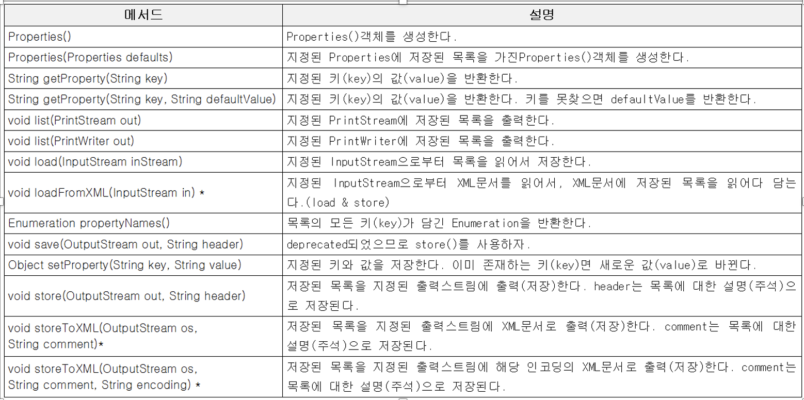

    - Set stringPropertyNames(): Properies에 저장되어 있는 모든 키를 Set에 담아서 반환한다.
- example1

    ```java
    import java.util.*;

    class PropertiesEx1 {
    	public static void main(String[] args) {
    		Properties prop = new Properties();

    		// prop에 키와 값(key, value)을 저장한다.
    		prop.setProperty("timeout","30");
    		prop.setProperty("language","kr");
    		prop.setProperty("size","10");
    		prop.setProperty("capacity","10");

    		// prop에 저장된 요소들을 Enumeration을 이용해서 출력한다.
    		Enumeration e = prop.propertyNames();

    		while(e.hasMoreElements()) {
    			String element = (String)e.nextElement();
    			System.out.println(element + "="+ prop.getProperty(element));
    		}

    		System.out.println();
    		prop.setProperty("size","20");	// size의 값을 20으로 변경한다.
    		System.out.println("size="       + prop.getProperty("size"));
    		System.out.println("capacity="   + prop.getProperty("capacity", "20"));
    		System.out.println("loadfactor=" + prop.getProperty("loadfactor", "0.75"));

    		System.out.println(prop);	// prop에 저장된 요소들을 출력한다.
    		prop.list(System.out);      // prop에 저장된 요소들을 화면(System.out)에 출력한다.
    	}
    }

    실행결과
    capacity=10
    size=10
    timeout=30
    language=kr

    size=20
    capacity=10
    loadfactor=0.75 // 키가 없으므로 디폴트값으로 지정한 0.75
    {capacity=10, size=20, language=kr} // System.out.println(prop);
    -- listing properties -- // prop.list(System.out);
    capacity=10
    size=20
    timeout=30
    language=kr
    ```

    - setProperty()는 단순히 Hashtable의 put메서드 호출
        - 기존에 같은 키로 저장된 값이 있는 경우 그 값을 Object타입으로 반환
        - 그렇지 않을 때는 null
    - getProperty()는 Properies에 저장된 값을 읽어오는 일을 한다.
        - 만약 키가 존재하지 않으면 지정된 기본값 반환
    - Properies는 Hashtable을 상속받아 구현한 것이라 Map의 특성상 저장순서 유지하지 않는다.
    - Properies는 컬렉션프레임워크 이전의 구버전이므로 Iterator가 아닌 Enumeration을 사용
    - 그리고 list메서드를 이용하면 Properies에 저장된 모든 데이터를 화면 또는 파일에 편리하게 출력할 수 있다.
        - System.out은 화면과 연결된 표준출력으로 System클래스에 정의된 PrintStream타입의 static 변수이다.
        - 15장에서 자세히
- example2

    ```java
    import java.io.*;
    import java.util.*;

    class PropertiesEx2 {
    	public static void main(String[] args) {
    		// commandline에서 inputfile을 지정해주지 않으면 프로그램을 종료한다.
    		if(args.length != 1) {
    			System.out.println("USAGE: java PropertiesEx2 INPUTFILENAME");
    			System.exit(0);
    		}

    		Properties prop = new Properties();

    		String inputFile = args[0];

    		try {
    			prop.load(new FileInputStream(inputFile));
    		} catch(IOException e) {
    			System.out.println("지정된 파일을 찾을 수 없습니다.");
    			System.exit(0);
    		}

    		String   name = prop.getProperty("name");
    		String[] data = prop.getProperty("data").split(",");
    		int max = 0;
    		int min = 0;
    		int sum = 0;

    		for(int i=0; i < data.length; i++) {
    			int intValue = Integer.parseInt(data[i]);
    			if (i==0) max = min = intValue;

    			if (max < intValue) {
    				max = intValue;
    			} else if (min > intValue) {
    				min = intValue;
    			}

    			sum += intValue;
    		}

    		System.out.println("이름 :"  + name);		
    		System.out.println("최대값 :" + max);
    		System.out.println("최소값 :" + min);
    		System.out.println("합계 :"  + sum);
    		System.out.println("평균 :"  + (sum*100.0/data.length)/100);
    	}
    }

    실행결과
    이름 :Seong Namkung
    최대값 :35
    최소값 :1
    합계 :111
    평균 :11.1

    input.txt
    # 이것은 주석
    # 여러줄 가능
    name=Seong Namkung
    data=9,1,5,2,8,13,26,11,35,1
    ```

    - 외부파일(input.txt)로부터 데이터를 입력받아서 계산결과를 보여주는 예제
    - 외부파일의 형식은 라인단위로 키와 값이 '='로 연결된 형태이어야 하며 주석라인은 첫 번째 문자가 #이어야 한다.
    - 정해진 규칙대로만 파일을 작성하면 load()를 호출하는 것만으로 쉽게 데이터를 읽어 올 수 있다.
    - 다만 인코딩문제로 한글이 깨질 수 있기 때문에 한글을 입력받으려면 아래와 같이 코드를 변경해야 한다.

        ```java
        String name = prop.getProperty("name");
        try {
        		name = new String(name.getBytes("8859_1"), "EUC-KR");
        } catch(Exception e) {}
        ```

        - 읽어온 데이터의 인코딩을 라틴문자집합에서 한글완성형(EUC-KR 또는 KSC5601)으로 변환해주는 과정 추가
- example3

    ```java
    import java.util.*;
    import java.io.*;

    class PropertiesEx3 {
    	public static void main(String[] args) {
    		Properties prop = new Properties();

    		prop.setProperty("timeout","30");
    		prop.setProperty("language","ÇŃąŰ");
    		prop.setProperty("size","10");
    		prop.setProperty("capacity","10");

    		try {
    			prop.store(new FileOutputStream("output.txt"), "Properties Example");
    			prop.storeToXML(new FileOutputStream("output.xml"),  "Properties Example");
    		} catch(IOException e) {
    			e.printStackTrace();		
    		}
    	} // mainŔÇ łĄ
    }
    ```

    - 반대로 Properties에 저장된 데이터를 store()와 storeToXML()를 이용해서 파일로 저장하는 방법
    - 여기서도 한글문제가 발생 XML은 에디터 등에서 한글편집이 가능하므로 XML 사용 권장
- example4

    ```java
    import java.util.*;

    class PropertiesEx4{
    	public static void main(String[] args) {
    		Properties sysProp = System.getProperties();
    		System.out.println("java.version :" + sysProp.getProperty("java.version"));
    		System.out.println("user.languag :" + sysProp.getProperty("user.language"));
    		sysProp.list(System.out);
    	}
    }

    실행결과
    java.version :1.8.0_51
    user_language:ko
    -- listing properties --
    java.runtime.name=~~
    sun.boot.library~
    ```

    - 시스템 속성을 가져오는 방법을 보여주는 예제
    - System 클래스의 getProperties()를 호출하면 시스템과 관련된 속성이 저장된 Properties 가져올수있다.
    - getProperty()를 통해 원하는 속성 얻을 수 있다.

### Collections

- 클래스이다.
- Arrays가 배열과 관련된 메서드를 제공하는 것처럼 Collections는 컬렉션과 관련된 메서드 제공
- fill(), copy(), sort(), binarySearch()등의 메서드는 두 클래스에 모두 포함되어 있으며 같은 기능을 한다.
    - 설명 생략

### 컬렉션의 동기화

- 멀티 쓰레드 프로그래밍에서는 하나의 객체를 여러 쓰레드가 동시에 접근할 수 있기 때문에 데이터의 일관성을 유지하기 위해서는 공유되는 객체에 동기화(synchronization)이 필요하다.
- Vector와 Hashtable 같은 구버젼의 클래스들은 자체적으로 동기화 처리가 되어 있는데, 멀티쓰레드 프로그래밍이 아닌 경우에는 불필요한 기능이 되어 성능을 떨어뜨리는 요인이 된다.
- 그래서 새로 추가된 컬렉션은 동기화를 자체적으로 처리하지 않고 필요한 경우에만 java.util.Collections 클래스의 동기화 메서드를 이용해서 동기화 처리가 가능하도록 변경하였다.
- 동기화 메서드

    ```java
    static Collections synchronizedCollection(Collection c)
    static List synchroziedList(List list)
    static Set synchroziedSet(Set s)
    static Map synchroziedMap(Map m)
    static SortedSet synchroziedSortedSet(SortedSet s)
    static SortedMap synchroziedSortedMap(SortedMap m)
    ```

- 동기화 메서드 사용하는 방법

    ```java
    List syncList = Collections.synchroziedList(new ArrayList(...));
    ```

    - 동기화에 대해서는 13장에서

### 변경불가 컬렉션 만들기

- 컬렉션에 저장된 데이터를 보호하기 위해서 컬렉션을 변경할 수 없게, 즉 읽기전용으로 만들어야할 때가 있다.
- 주로 멀티 쓰레드 프로그래밍에서 여러 쓰레드가 하나의 컬렉션을 공유하다보면 데이터가 손상될 수 있는데 이를 방지하려면 아래의 메서드들을 이용하자
- 변경불가 메서드

    ```java
    static Collections unmodifiableCollection(Collection c)
    static List unmodifiableList(List list)
    static Set unmodifiableSet(Set s)
    static Map unmodifiableMap(Map m)
    static NavigableSet unmodifiableNavigableSet(NavigableSet s)
    static SortedSet unmodifiableSortedSet(SortedSet s)
    static NavigableMap unmodifiableNavigableMap(NavigableMap m)
    static SortedMap unmodifiableSortedMap(SortedMap m)
    ```

### 싱글톤 컬렉션

- 단 하나의 객체만을 저장하는 컬렉션을 만들고 싶을 경우가 있다.
- 메서드

    ```java
    static List singletonList(Object o)
    static Set singleton(Object o) // singletonSet이 아님
    static Map singletonMap(Object key, Object value)
    ```

    - 매개변수로 저장할 요소를 지정하면, 해당 요소를 저장하는 컬렉션을 반환한다.
    - 반환된 컬렉션은 변경할 수 없다.

### 한 종류의 객체만 저장하는 컬렉션 만들기

- 컬렉션에 지정된 종류의 객체만 저장할 수 있도록 제한하고 싶을 때
- 메서드

    ```java
    static Collections checkedCollection(Collection c, Class type)
    static List checkedList(List list, Class type)
    static Set checkedSet(Set s, Class type)
    static Map checkedMap(Map m, Class keytype, Class valueType)
    static Queue checkedQueue(Queue queue, Class type)
    static NavigableSet checkedNavigableSet(NavigableSet s, Class type)
    static SortedSet checkedSortedSet(SortedSet s, Class type)
    static NavigableMap checkedNavigableMap(NavigableMap m,
    																				Class keytype, Class valueType)
    static SortedMap checkedSortedMap(SortedMap m,
    																	Class keytype, Class valueType)
    ```

- 사용 방법

    ```java
    List list = new ArrayList();
    List checkedList = checkedList(list, String.class);
    checkedList.add("abc"); //ok
    checkedList.add(new Integer(3)); // 에러, ClassCastException 발생
    ```

    - 지네릭스로 간단히 처리할 수 있는데도 이런 메서드들을 제공하는 이유는 호환성 때문이다.
    - 지네릭스가 도입되기전인 JDK 1.5이전 작성된 코드를 사용할 때는 이 메서드들이 필요할 수 있다.
- example
    - 나머지 소개안한 메서드들

    ```java
    import java.util.*;
    import static java.util.Collections.*;

    class CollectionsEx {
    	public static void main(String[] args) {
    		List list = new ArrayList();
    		System.out.println(list);
    		
    		addAll(list, 1,2,3,4,5);
    		System.out.println(list);
    		
    		rotate(list, 2);	// 오른쪽으로 두 칸씩 이동
    		System.out.println(list);
    		
    		swap(list, 0, 2);	// 첫 번째와 세 번째를 교환(swap)
    		System.out.println(list);
    		
    		shuffle(list);		// 저장된 요소의 위치를 임의로 변경
    		System.out.println(list);
    		
    		sort(list);
    		System.out.println(list);
    		
    		sort(list, reverseOrder());	// 역순 정렬 reverse(list);와 동일
    		System.out.println(list);
    		
    		int idx = binarySearch(list, 3);	// 3이 저장된 위치(index)를 반환
    		System.out.println("index of 3 = " + idx);
    		
    		System.out.println("max = " + max(list));
    		System.out.println("min = " + min(list));
    		System.out.println("min = " + max(list, reverseOrder()));
    		
    		fill(list, 9);	// list를 9로 채움
    		System.out.println("list = " + list);
    		
    		// list와 같은 크기의 새로운 list를 생성하고 2로 채운다. 단, 결과는 변경 불가
    		List newList = nCopies(list.size(), 2);
    		System.out.println("newList = " + newList);
    		
    		System.out.println(disjoint(list, newList));		// 공통요소가 없으면 true
    		
    		copy(list, newList);
    		System.out.println("newList = " + newList);
    		System.out.println("list = " + list);
    		
    		replaceAll(list, 2, 1);
    		System.out.println("list = " + list);
    		
    		Enumeration e = enumeration(list);
    		ArrayList list2 = list(e);
    		
    		System.out.println("list2 = " + list2);
    	}
    }

    실행결과
    []
    [1,2,3,4,5]
    [4,5,1,2,3]
    [1,5,4,2,3]
    [4,1,2,3,5]
    [5,4,3,2,1]
    [1,2,3,4,5]
    index of 3 = 2
    max=5
    min=1
    min=1
    list=[9,9,9,9,9]
    newList=[2,2,2,2,2]
    true
    newList=[2,2,2,2,2]
    list=[2,2,2,2,2]
    list=[1,1,1,1,1]
    list2=[1,1,1,1,1]
    ```